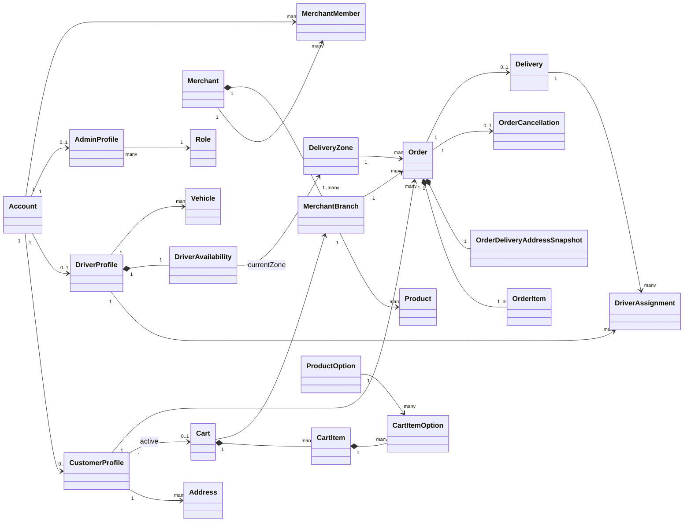
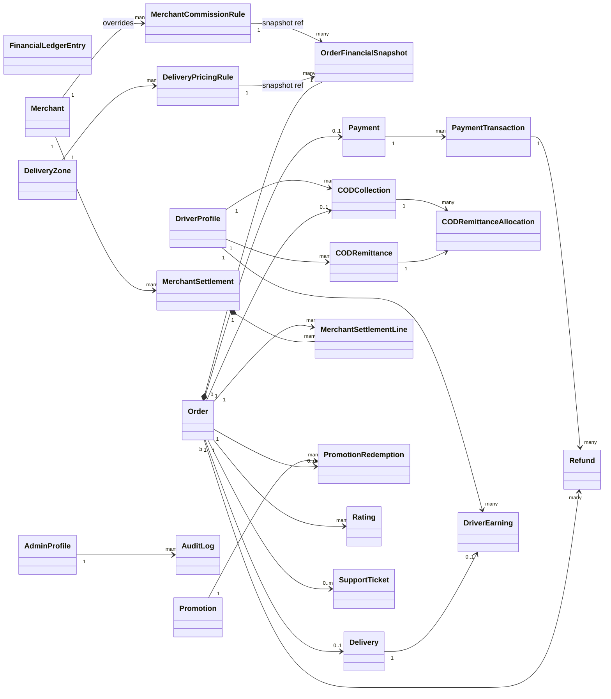

# SpeedyGo Domain Model v1.0

**Status: FROZEN — 1 September 2026**

This is the canonical business/domain architecture for SpeedyGo.

It describes **what exists in the business**, not tables, Prisma models, HTTP resources, or UI classes.

```
SpeedyGo Domain Model v1.0
        →  ERD v1.0
        →  Prisma Schema v1.0
        →  Prisma Schema v1.1 additive CartItemOption
        →  Backend implementation
```

Do not generate the ERD or Prisma contract from assumptions that are not in this document.

This document is **not** a database dump. Attribute lists name domain facts. Storage types, indexes, and table names are ERD concerns.

---

## Architectural invariants

These rules are frozen.

1. Driver earnings ≠ COD cash collected.
2. Merchant gross merchandise sales ≠ merchant commission ≠ merchant net.
3. Merchant commission ≠ delivery fee.
4. Customer delivery fee ≠ driver remuneration ≠ SpeedyGo delivery share.
5. Order status ≠ merchant fulfillment status ≠ delivery status ≠ payment status ≠ refund status ≠ COD reconciliation status.
6. Cancellation ≠ refund.
7. Historical financial snapshots are immutable.
8. Changing a merchant commission must affect only future eligible orders from the effective date.
9. Changing delivery pricing must not recalculate historical orders.
10. The backend is authoritative for all financial calculations.
11. Frontend applications must never independently calculate authoritative financial values.

Money uses **integer minor units**. Rates use **integer basis points** where appropriate.

```
2 200 DZD  =  220000 minor units
7%         =  700 basis points
```

Do not use floating-point arithmetic for authoritative financial values.

---

## Bounded domains

| # | Domain |
| --- | --- |
| 1 | Identity & Access |
| 2 | Customer |
| 3 | Merchant & Catalog |
| 4 | Driver & Vehicle |
| 5 | Geography / Delivery Zones |
| 6 | Pricing |
| 7 | Merchant Commission |
| 8 | Order |
| 9 | Delivery |
| 10 | Driver Remuneration |
| 11 | Payment |
| 12 | COD Reconciliation |
| 13 | Refunds |
| 14 | Merchant Settlement |
| 15 | Financial Ledger |
| 16 | Promotions |
| 17 | Ratings |
| 18 | Notifications |
| 19 | Support |
| 20 | Administration / Audit / Settings |

---

## 1. Identity & Access

One `Account` is the login identity. Customer, driver, and admin capabilities are optional profiles on that account. A merchant person is an `Account` linked through `MerchantMember`, not a fourth profile type.

### Account

- id
- phone
- email
- status
- createdAt
- updatedAt

### Session

- id
- accountId
- refreshTokenHash
- deviceId
- expiresAt
- revokedAt

### Device

- id
- accountId
- platform
- appVersion
- lastSeenAt

### CustomerProfile

- id
- accountId
- fullName
- avatarUrl

### DriverProfile

- id
- accountId
- fullName
- verificationStatus
- approvedAt

### AdminProfile

- id
- accountId
- roleId
- displayName
- twoFactorEnabled

v1.0 uses **one primary Role** per AdminProfile.

### Role

- id
- name
- description
- active

### Permission

- id
- code
- description

### RolePermission

- roleId
- permissionId

### Relationships

- Account 1 → 0..1 CustomerProfile
- Account 1 → 0..1 DriverProfile
- Account 1 → 0..1 AdminProfile
- Account 1 → many Session
- Account 1 → many Device
- AdminProfile many → 1 Role
- Role many → many Permission through RolePermission

---

## 2. Customer

### Address

- id
- customerId
- label
- addressText
- latitude
- longitude
- isDefault

### Cart

- id
- customerId
- merchantBranchId
- updatedAt

A customer has at most one **active** cart. Cart prices are not authoritative; converting a cart to an order is a backend command that produces an `Order` and an immutable `OrderFinancialSnapshot`.

### CartItem

- id
- cartId
- productId
- quantity
- unitPriceMinor

### CartItemOption

- id
- cartItemId
- productOptionId

Persisted selected ProductOption on a CartItem. No price or name snapshots. Live Catalog remains authoritative while Cart is mutable. This composition exists so Cart configuration survives API requests and can feed bootstrap, live pricing, readiness, future Checkout, and future Order snapshots.

A CartItem may have zero or many CartItemOption rows. The same ProductOption may appear at most once on the same CartItem.

### Relationships

- CustomerProfile 1 → many Address
- CustomerProfile 1 → 0..1 active Cart
- Cart 1 composition → many CartItem
- CartItem 1 composition → many CartItemOption
- ProductOption 1 → many CartItemOption

---

## 3. Merchant & Catalog

### Merchant

- id
- publicReference
- name
- status
- verifiedAt

### MerchantBranch

- id
- merchantId
- name
- phone
- addressText
- latitude
- longitude
- wilayaCode (optional nullable; official two-digit wilaya code, preserves leading zeros)
- communeId (optional nullable; SpeedyGo administrative catalogue id, not an ONS postal code)
- operationalStatus

Legacy branches may omit wilaya/commune. New branch create and explicit administrative-location edits require a valid (wilayaCode, communeId) pair where the commune belongs to that wilaya.

### Wilaya

Platform administrative reference (Algeria). Not a delivery zone.

- code (VARCHAR 2, PK — `"01"`…`"69"`, leading zeros preserved)
- nameFr
- nameAr

### Commune

Platform administrative reference. Belongs to exactly one Wilaya.

- id (Int PK — catalogue-stable internal id from the SpeedyGo Algeria dataset; **not** an official ONS commune code)
- wilayaCode (FK → Wilaya.code)
- nameFr
- nameAr
- aliasesFr (optional JSON array of French spelling variants for search)

### MerchantMember

- id
- merchantId
- accountId
- role

### MerchantDocument

- id
- merchantId
- type
- fileUrl
- status
- expiryDate

### CommerceVertical

Platform-managed Home taxonomy. Distinct from branch menu `Category`. Never inferred from merchant or branch names.

- id
- slug
- name
- iconKey (allowlisted Material icon token)
- sortOrder
- active

A deactivated vertical remains on existing classifications. It is omitted from Customer Home listing and cannot be used as a filter. It does not hide otherwise-visible storefronts from the unfiltered discovery list.

### MerchantBranchClassification

Explicit 0..1 assignment of a MerchantBranch to a CommerceVertical.

- id
- branchId
- verticalId

Unclassified branches remain valid and stay visible in the unfiltered Customer storefront list.

### MerchantBranchAvailabilityOverride

Optional 0..1 Merchant-controlled pause of **new** order acceptance for a MerchantBranch. Independent of Merchant approval and Branch `operationalStatus`. Independent of the weekly opening schedule.

- id
- branchId (unique)
- mode (`FOLLOW_SCHEDULE` | `FORCE_CLOSED` | `TEMPORARY_CLOSED`)
- reasonCode (optional vocabulary)
- customerMessage (optional)
- closedUntil (required when temporary; absolute instant)
- version
- updatedByAccountId

`FOLLOW_SCHEDULE` means the weekly hours decide. It does not mean the store is currently open. `FORCE_CLOSED` blocks new orders until manual reopen. `TEMPORARY_CLOSED` blocks until `closedUntil`, then schedule evaluation resumes (expiry alone never claims open).

### MerchantBranchCover

One optional public storefront cover image per MerchantBranch. Separate from private MerchantDocument verification evidence.

- id
- branchId
- objectId (opaque storage id; never a client-writable path)
- contentType
- byteSize
- widthPx
- heightPx

### MerchantBranchLogo

One optional storefront logo per MerchantBranch, scoped like `MerchantBranchCover` (the storefront, store name and cover are all Branch-level). Separate from the cover, product images and private MerchantDocument verification evidence. Currently read only by authenticated Merchant members (all roles); OWNER and MANAGER change it. No Customer projection exposes it.

- id
- branchId (unique)
- objectId (opaque storage id in the `logos/` namespace; never a client-writable path)
- contentType
- byteSize
- widthPx
- heightPx

Replacing a logo always writes a new object id. The previous object is deleted only when no logo row still references it. Removing a logo that does not exist is a successful no-op.

### MerchantBranchHoursException

Optional per-date replacement of a MerchantBranch weekly schedule. The date is an `Africa/Algiers` civil date. At most one exception per Branch and date.

- id
- branchId
- localDate (civil date, `Africa/Algiers`)
- closed (true: closed all day; false: open only during its intervals)
- label (Merchant-facing reason, e.g. "Aïd el-Fitr")
- customerMessage (optional)
- version
- updatedByAccountId

### MerchantBranchHoursExceptionInterval

- id
- exceptionId
- opensMinute, closesMinute (0..1439)
- closesNextDay (true only for an interval ending exactly at midnight)
- sortOrder

An exception governs its whole civil date `[00:00, 24:00)`. It never spills into the next date (no overnight intervals), and a weekly overnight interval from the previous date stops at the exception date's midnight. A closed exception has no intervals; an open exception has 1–3. Exceptions apply only while weekly hours are configured. Precedence: platform eligibility, then an active `FORCE_CLOSED` / `TEMPORARY_CLOSED` override, then the exception, then the weekly schedule. Every write carries the expected `version` (optimistic concurrency); a mismatch writes nothing.

### Category

- id
- merchantBranchId
- name
- sortOrder
- active

### Product

- id
- merchantBranchId
- categoryId
- name
- description
- priceMinor
- available
- duplicateRequestKey (optional; set only on a Product created by duplication)

Catalog `priceMinor` is the current list price. An order copies names and amounts into line snapshots; later catalog edits do not rewrite history.

Duplication creates a new Product in the source's Branch and Category in one transaction: core fields, option groups (required choices and optional extras) and options get new ids, the photograph (when the source has a stored one) is copied to a new storage object, and the copy starts `available=false` while option availability is copied as is. The source is never written. Order history, ratings, reports and audit identity are never copied. `duplicateRequestKey` (SHA-256 of the source id and the lower-cased client request id) makes a retried or concurrent identical request return the copy already created instead of creating another.

### ProductImage

One optional public product photograph per Product. Separate from storefront covers and private MerchantDocument verification evidence.

- id
- productId
- objectId (opaque storage id; never a client-writable path)
- contentType
- byteSize
- widthPx
- heightPx

### ProductOptionGroup

- id
- productId
- name
- required
- minSelections
- maxSelections

### ProductOption

- id
- optionGroupId
- name
- additionalPriceMinor
- available

### Relationships

- Merchant 1 composition → 1..many MerchantBranch
- Merchant 1 → many MerchantMember
- Account 1 → many MerchantMember
- Merchant 1 → many MerchantDocument
- MerchantBranch 1 → many Category
- MerchantBranch 1 → many Product
- MerchantBranch 0..1 → MerchantBranchClassification
- MerchantBranch 0..1 → MerchantBranchCover
- MerchantBranch 0..1 → MerchantBranchLogo
- MerchantBranch 0..1 → MerchantBranchAvailabilityOverride
- MerchantBranch 1 → many MerchantBranchHoursException (one per civil date)
- MerchantBranchHoursException 1 composition → 0..3 MerchantBranchHoursExceptionInterval
- MerchantBranch 0..1 → Wilaya (via wilayaCode)
- MerchantBranch 0..1 → Commune (via communeId)
- Wilaya 1 → many Commune
- CommerceVertical 1 → many MerchantBranchClassification
- Category 1 → many Product
- Product 0..1 → ProductImage
- Product 1 composition → many ProductOptionGroup
- ProductOptionGroup 1 composition → many ProductOption

---

## 4. Driver & Vehicle

### Vehicle

- id
- driverId
- type
- plateNumber
- model
- color
- status

### DriverDocument

- id
- driverId
- type
- fileUrl
- status
- expiryDate

### DriverAvailability

- driverId
- status
- currentZoneId
- offlineAfterCurrentDelivery
- updatedAt

`status` uses `DriverAvailabilityStatus` (see state machines). `offlineAfterCurrentDelivery` records the driver’s intent; the status value `OFFLINE_AFTER_CURRENT_DELIVERY` is the machine state.

### DriverLiveLocation

Transient / realtime infrastructure data. Normally held in Redis. **Not** a required permanent relational entity.

- driverId
- latitude
- longitude
- heading
- speed
- recordedAt

### Relationships

- DriverProfile 1 → many Vehicle
- DriverProfile 1 → many DriverDocument
- DriverProfile 1 composition → 1 DriverAvailability
- DriverProfile 1 → 0..1 live DriverLiveLocation

---

## 5. Geography / Delivery Zones

### DeliveryZone

- id
- name
- polygon / geometry
- active

A driver’s availability may reference `currentZoneId`.

An Order snapshots / references the **resolved** delivery zone at creation (`Order.deliveryZoneId`). Later zone-geometry edits do not rewrite that order.

### Relationships

- DeliveryZone 1 → many DeliveryPricingRule
- DeliveryZone 1 → many Order
- DriverAvailability many → 0..1 DeliveryZone (current zone)

---

## 6. Pricing

SpeedyGo supports time-dependent delivery pricing (for example day / night). The model must allow additional future bands without a rewrite.

### DeliveryPricingRule

- id
- zoneId
- name
- timeBand
- startLocalTime
- endLocalTime
- customerDeliveryFeeMinor
- driverRemunerationMinor
- effectiveFrom
- effectiveTo
- active

`timeBand` examples: `DAY`, `NIGHT`, `CUSTOM`. Do not hardcode only day/night.

`customerDeliveryFeeMinor` and `driverRemunerationMinor` are distinct amounts. SpeedyGo delivery share is derived at snapshot time and stored on `OrderFinancialSnapshot`; it is not the same as either fee.

### Relationships

- DeliveryZone 1 → many DeliveryPricingRule
- DeliveryPricingRule 1 → many historical OrderFinancialSnapshot references

When an Order is created, selected pricing values are **snapshotted**. Historical orders do not depend on the mutable rule.

---

## 7. Merchant Commission

SpeedyGo supports:

- **A.** a global default commission
- **B.** a merchant-specific override

One rule entity covers both.

### MerchantCommissionRule

- id
- scope
- merchantId (nullable)
- rateBps
- effectiveFrom
- effectiveTo
- changeReason
- changedByAdminId
- active

`CommissionScope`:

- `GLOBAL_DEFAULT` — `merchantId` **must** be null
- `MERCHANT_OVERRIDE` — `merchantId` **must** reference a Merchant

### Resolution at order creation

1. Find an applicable merchant-specific override.
2. Otherwise use the applicable global default.
3. Snapshot the resolved rate, amount, and rule id into `OrderFinancialSnapshot`.

Changing a rule affects **only future eligible orders**. Never recalculate historical orders.

### Relationships

- Merchant 1 → many MerchantCommissionRule where scope = `MERCHANT_OVERRIDE`
- AdminProfile 1 → many MerchantCommissionRule changes
- MerchantCommissionRule 1 → many historical OrderFinancialSnapshot references

---

## 8. Order

The Order is the commercial document. Its status is **not** fulfillment, delivery, payment, refund, or COD status.

### Order

- id
- publicReference
- customerId
- merchantBranchId
- deliveryZoneId
- status
- fulfillmentStatus
- createdAt
- confirmedAt
- completedAt
- preparationMinutes (nullable — Merchant prep estimate duration chosen at accept)
- originalPreparationMinutes (nullable — immutable)
- estimatedReadyAt (nullable — current prep ready instant; ≠ Delivery ETA)
- originalEstimatedReadyAt (nullable — first estimate; immutable)
- preparationEstimateVersion (integer; 0 = no estimate)

`status` uses `OrderStatus`. `fulfillmentStatus` uses `FulfillmentStatus`. Both live on the Order as separate facts.

See [MERCHANT_ORDER_PREPARATION_ESTIMATE_FOUNDATION.md](./MERCHANT_ORDER_PREPARATION_ESTIMATE_FOUNDATION.md).

### OrderPreparationEstimateRevision

- id
- orderId
- revisionNumber
- previousEstimatedReadyAt
- newEstimatedReadyAt
- addMinutes
- reason
- actorAccountId
- createdAt

Append-only history of prep estimate changes (including the initial accept estimate).

### OrderItem

- id
- orderId
- productId (nullable — catalog product may later be removed)
- productNameSnapshot
- quantity
- unitPriceMinor
- lineTotalMinor

### OrderItemOption

- id
- orderItemId
- optionNameSnapshot
- additionalPriceMinor

### OrderDeliveryAddressSnapshot

- orderId
- addressText
- latitude
- longitude
- instructions

### OrderStatusEvent

- id
- orderId
- eventType
- actorType
- actorId
- fromStatus
- toStatus
- occurredAt

Customer-facing timers are **derived** from these events and delivery timestamps. There is no Timer / Countdown / Chronometer entity.

### OrderCancellation

- id
- orderId
- reason
- internalNote
- cancelledBy
- cancelledAt

Cancellation is not a refund. It may later cause a Refund to be requested; it does not complete one.

### Relationships

- CustomerProfile 1 → many Order
- MerchantBranch 1 → many Order
- DeliveryZone 1 → many Order
- Order 1 composition → 1..many OrderItem
- OrderItem 1 composition → many OrderItemOption
- Order 1 composition → 1 OrderDeliveryAddressSnapshot
- Order 1 composition → 1 OrderFinancialSnapshot
- Order 1 → many OrderStatusEvent
- Order 1 → 0..1 OrderCancellation
- Order 1 → 0..1 Delivery
- Order 1 → 0..1 Payment
- Order 1 → 0..1 CODCollection
- Order 1 → many Refund
- Order 1 → many Rating
- Order 1 → many MerchantSettlementLine
- Order 1 → 0..many PromotionRedemption

---

## 9. Order financial snapshot

Critical. Created when the order is financially established (at creation / confirmation — exact instant is an implementation detail; the snapshot is then immutable).

### OrderFinancialSnapshot

- orderId
- currency
- grossMerchandiseSubtotalMinor
- merchantDiscountMinor
- platformDiscountMinor
- totalDiscountMinor
- commissionBaseMinor
- merchantCommissionRateBps
- merchantCommissionAmountMinor
- merchantNetAmountMinor
- customerDeliveryFeeMinor
- driverRemunerationMinor
- speedyGoDeliveryShareMinor
- serviceFeeMinor
- customerPayableMinor
- commissionRuleId
- pricingRuleId
- pricingVersion / reference (optional)
- createdAt

### Frozen arithmetic shape

```
grossMerchandiseSubtotal
  minus applicable discounts
  → commissionBase
```

**Which discount types reduce `commissionBaseMinor` is not frozen.**

REQUIRES BUSINESS CONFIRMATION — do not silently decide whether merchant-funded, SpeedyGo-funded, or both discounts reduce the commission base.

### Immutability

After creation, the snapshot is immutable except through explicit financial adjustment / reversal mechanisms (Refund, settlement lines, ledger reversals). Do **not** silently mutate historic financial data when rules change.

### Relationships

- Order 1 composition → 1 OrderFinancialSnapshot
- MerchantCommissionRule 1 → many historical OrderFinancialSnapshot references
- DeliveryPricingRule 1 → many historical OrderFinancialSnapshot references

---

## 10. Delivery

Movement and assignment of an order from merchant pickup to customer. Not the Order itself.

### Delivery

- id
- orderId
- status
- driverSearchStartedAt
- pickedUpAt
- estimatedArrivalAt
- arrivedCustomerAt
- deliveredAt

### DriverAssignment

- id
- deliveryId
- driverId
- status
- assignedAt
- acceptedAt
- releasedAt

DriverAssignment belongs to **Delivery**, never as a direct property of Order. Reassignment is a new assignment (and release of the previous), not an overwrite of Order.

### DeliveryEvent

- id
- deliveryId
- type
- driverId
- occurredAt

### DeliveryProof

- id
- deliveryId
- deliveryPinHash
- proofImageUrl
- verifiedAt

### Relationships

- Order 1 → 0..1 Delivery
- Delivery 1 → many DriverAssignment
- DriverProfile 1 → many DriverAssignment
- Delivery 1 → many DeliveryEvent
- Delivery 1 → 0..1 DeliveryProof
- Delivery 1 → 0..1 DriverEarning

---

## 11. Driver remuneration

What SpeedyGo owes the driver for work. **Not** COD cash collected.

### DriverEarning

- id
- deliveryId
- driverId
- baseRemunerationMinor
- bonusMinor
- adjustmentMinor
- netEarningMinor
- status
- validatedAt

`baseRemunerationMinor` typically originates from the order’s snapshotted `driverRemunerationMinor`. Bonuses and adjustments are separate.

Never deduct COD collections from driver earnings as if they were the same concept.

### Relationships

- Delivery 1 → 0..1 DriverEarning
- DriverProfile 1 → many DriverEarning

---

## 12. Payment

MVP: **one Payment aggregate per Order**.

Gateway retries and webhook confirmations are `PaymentTransaction` rows, not extra Payments.

### Payment

- id
- orderId
- method
- status
- amountMinor
- currency
- createdAt

### PaymentTransaction

- id
- paymentId
- provider
- providerReference
- status
- amountMinor
- idempotencyKey
- processedAt

Represents gateway attempts, retries, and webhook-confirmed processing records.

If split-payment is introduced later, revisit cardinality in a new architecture version.

### Relationships

- Order 1 → 0..1 Payment
- Payment 1 → many PaymentTransaction
- PaymentTransaction 1 → many Refund (optional from the Refund side)

---

## 13. COD Reconciliation

Cash collected by the driver. Separate from Payment card flows, driver pay, and order status.

Supports **partial remittance**. Remaining unremitted cash is not automatically a discrepancy.

Example:

```
Collected:         4 800 DZD
Already remitted:  2 500 DZD
Remaining:         2 300 DZD   ← still expected custody, not a discrepancy
```

### CODCollection

- id
- orderId
- driverId
- expectedAmountMinor
- collectedAmountMinor
- collectedAt
- status

### CODRemittance

- id
- driverId
- submittedAmountMinor
- confirmedAmountMinor
- status
- reference
- proofUrl
- submittedAt
- confirmedAt

### CODRemittanceAllocation

- id
- remittanceId
- collectionId
- allocatedAmountMinor

### CODDiscrepancy

- id
- driverId
- remittanceId
- expectedMinor
- confirmedMinor
- differenceMinor
- status
- cause
- resolution

### Relationships

- Order 1 → 0..1 CODCollection
- DriverProfile 1 → many CODCollection
- DriverProfile 1 → many CODRemittance
- CODRemittance 1 → many CODRemittanceAllocation
- CODCollection 1 → many CODRemittanceAllocation
- CODRemittance 1 → 0..1 CODDiscrepancy

COD status vocabularies stay **separate** from Order / Payment / Refund. Exact collection / remittance / discrepancy names: see [STATE_MACHINES.md](./STATE_MACHINES.md) and REQUIRES BUSINESS CONFIRMATION.

---

## 14. Refunds

A recorded decision to return money. Not implied by cancellation.

Supports electronic and COD / manual processes.

### Refund

- id
- orderId
- paymentTransactionId (nullable)
- refundMethod
- amountMinor
- status
- reason
- internalNote
- requestedByAdminId
- requestedAt
- completedAt

`RefundMethod`:

- `ORIGINAL_PAYMENT` — `paymentTransactionId` should normally reference the transaction being refunded
- `MANUAL_COD` — `paymentTransactionId` may be null
- `MANUAL_OTHER` — `paymentTransactionId` may be null

An order may have multiple **partial** Refund records if business rules allow it.

A Refund is not an `OrderCancellation`.

### Relationships

- Order 1 → many Refund
- PaymentTransaction 1 → many Refund (optional from Refund)
- AdminProfile 1 → many requested Refund

Commission reversal, who absorbs losses after delivery, and partial-refund commercial rules are **not** frozen (REQUIRES BUSINESS CONFIRMATION).

---

## 15. Merchant Settlement

Period payout of what SpeedyGo owes a merchant. Historical settlements are immutable. Later events create new lines in later settlements.

### MerchantSettlement

- id
- merchantId
- periodStart
- periodEnd
- grossSalesMinor
- commissionMinor
- refundAdjustmentsMinor
- manualAdjustmentsMinor
- netPayableMinor
- status
- paidAt

### MerchantSettlementLine

- id
- settlementId
- orderId (nullable)
- type
- grossMerchandiseMinor
- commissionMinor
- merchantNetMinor
- adjustmentMinor
- reference
- createdAt

`SettlementLineType`:

- `SALE`
- `REFUND_ADJUSTMENT`
- `MANUAL_ADJUSTMENT`
- `REVERSAL`

An Order must **not** be limited to one settlement line.

Example: Settlement A records `SALE` for an order; Settlement B later records `REFUND_ADJUSTMENT` for the same order.

### Relationships

- Merchant 1 → many MerchantSettlement
- MerchantSettlement 1 composition → many MerchantSettlementLine
- Order 1 → many MerchantSettlementLine

---

## 16. Financial Ledger

SpeedyGo’s **operational** financial ledger. Append-oriented. Not a complete double-entry ERP.

Corrections create compensating / reversal entries. Do not silently rewrite history.

### FinancialLedgerEntry

- id
- orderId (nullable)
- merchantId (nullable)
- driverId (nullable)
- type
- direction
- amountMinor
- currency
- reversalOfId (nullable)
- reference
- createdAt

Example `type` values:

- `CUSTOMER_PAYMENT`
- `MERCHANT_PAYABLE`
- `MERCHANT_COMMISSION`
- `DRIVER_PAYABLE`
- `DELIVERY_REVENUE`
- `SERVICE_FEE`
- `COD_CUSTODY`
- `REFUND`
- `ADJUSTMENT`
- `REVERSAL`

---

## 17. Promotions

### Promotion

- id
- code
- type
- value
- startsAt
- endsAt
- active
- customerDiscoverable (default false — existing offers stay undisclosed)
- customerLabel (optional Customer-facing lime-pill text; presentation only)

`value` is interpreted according to `type` (amount in minor units or rate in bps). Authoritative discount amounts on an order live on the snapshot and on `PromotionRedemption.discountAmountMinor`.

`customerDiscoverable` is **not** cart eligibility. An authorized Admin must publish an offer before `GET /customer/promotions` may return it. Checkout preview and Order create remain the only authority for whether a code applies to a cart. Reading discovery never creates a `PromotionRedemption`.

### PromotionRedemption

- id
- promotionId
- customerId
- orderId
- discountAmountMinor
- fundedBy
- redeemedAt

`PromotionFundingSource`:

- `SPEEDYGO`
- `MERCHANT`
- `SHARED`

The domain allows zero or many redemptions per order so future stacking remains possible. If MVP allows only one promotion per order, enforce that in application / business rules, not by collapsing the model.

How merchant-funded vs SpeedyGo-funded discounts affect `commissionBaseMinor`: REQUIRES BUSINESS CONFIRMATION.

### Relationships

- Promotion 1 → many PromotionRedemption
- CustomerProfile 1 → many PromotionRedemption
- Order 1 → 0..many PromotionRedemption

---

## 18. Ratings

One Rating concept. Do **not** put `merchantId` and `driverId` simultaneously on Rating.

### Rating

- id
- orderId
- customerId
- targetType
- targetId
- score
- comment
- createdAt

`RatingTargetType`:

- `DRIVER`
- `MERCHANT`

Business validation must ensure `targetId` matches `targetType` and that the target participated in that Order.

The ERD may later split `DriverRating` / `MerchantRating` for stronger relational integrity. The domain keeps one Rating concept.

### Relationships

- Order 1 → many Rating
- CustomerProfile 1 → many Rating

---

## 19. Notifications

High demand is **not** an entity. Flow: demand detection → domain / system event → Notification service → NotificationTemplate → Notification.

### DeviceToken

- id
- accountId
- deviceId
- token
- platform
- active

### NotificationTemplate

- id
- code
- audience
- trigger
- channel
- titleTemplate
- bodyTemplate
- active

### Notification

- id
- accountId
- templateId
- title
- body
- category
- read
- createdAt

### NotificationDeliveryLog

- id
- notificationId
- channel
- status
- providerReference
- sentAt

### Relationships

- Account 1 → many DeviceToken
- Device 1 → many DeviceToken
- Account 1 → many Notification
- NotificationTemplate 1 → many Notification
- Notification 1 → many NotificationDeliveryLog

---

## 20. Support

### SupportTicket

- id
- publicReference
- createdByAccountId
- orderId (nullable)
- merchantId (nullable)
- driverId (nullable)
- status
- priority
- assignedAdminId (nullable)
- createdAt

### SupportMessage

- id
- ticketId
- authorAccountId
- body
- createdAt

### SupportInternalNote

- id
- ticketId
- adminId
- body
- createdAt

### Relationships

- SupportTicket 1 composition → many SupportMessage
- SupportTicket 1 composition → many SupportInternalNote
- AdminProfile 1 → many SupportInternalNote
- Account 1 → many SupportTicket (as creator)
- Order 1 → 0..many SupportTicket

---

## 21. Administration / Audit / Settings

### AuditLog

- id
- adminId
- action
- targetType
- targetId
- beforeJson
- afterJson
- ipAddress
- sessionId
- createdAt

Append-only from normal application behavior.

### PlatformSetting

- id
- key
- valueJson
- updatedByAdminId
- updatedAt

Financial configuration that affects orders must still go through dated rules (`MerchantCommissionRule`, `DeliveryPricingRule`) and snapshots. Settings must not rewrite historical money.

### Relationships

- AdminProfile 1 → many AuditLog
- AdminProfile 1 → many PlatformSetting changes

---

## State-machine boundaries

Do **not** collapse these into one Order status enum. See [STATE_MACHINES.md](./STATE_MACHINES.md).

### OrderStatus

`CREATED` · `CONFIRMED` · `ACTIVE` · `COMPLETED` · `CANCELLED` · `FAILED`

### FulfillmentStatus

`PENDING_ACCEPTANCE` · `ACCEPTED` · `PREPARING` · `READY`

### DeliveryStatus

`SEARCHING_DRIVER` · `DRIVER_ASSIGNED` · `TO_PICKUP` · `AT_PICKUP` · `PICKED_UP` · `IN_TRANSIT` · `ARRIVED_CUSTOMER` · `DELIVERED` · `FAILED` · `CANCELLED`

### PaymentStatus

`PENDING` · `PROCESSING` · `SUCCEEDED` · `FAILED` · `CANCELLED`

### RefundStatus

`REQUESTED` · `UNDER_REVIEW` · `APPROVED` · `PROCESSING` · `REFUNDED` · `REJECTED` · `FAILED`

### DriverAvailabilityStatus

`OFFLINE` · `ONLINE` · `OFFLINE_AFTER_CURRENT_DELIVERY` · `SUSPENDED`

COD collection, remittance, and discrepancy statuses remain separate machines. Exact COD names are not fully frozen (REQUIRES BUSINESS CONFIRMATION).

---

## Driver offline-after-current-delivery

Frozen operational rule.

If the driver has **no** active Delivery:

```
ONLINE  →  requested offline  →  OFFLINE
```

If the driver **has** an active Delivery:

```
ONLINE  →  requested offline  →  OFFLINE_AFTER_CURRENT_DELIVERY
```

- The active Delivery continues normally.
- The driver receives **no new** assignments.
- After that Delivery completes:

```
OFFLINE_AFTER_CURRENT_DELIVERY  →  OFFLINE
```

---

## Customer timer / ETA (not a domain entity)

Do **not** create Timer, Countdown, or Chronometer entities.

Customer-facing stage timing is derived from:

- `OrderStatusEvent`
- `DeliveryEvent`
- `Delivery.estimatedArrivalAt`
- merchant preparation timestamps (fulfillment transitions / events)

Example: preparation started 20:17, expected ready 20:33 → UI may show “Prête dans ~6 min”.

Driver ETA derives from Delivery / route estimation, not from a Timer aggregate.

---

## Frozen architecture decisions — v1.0

- Modular monolith backend; domains above are logical modules, not microservices.
- Separate state machines for order, fulfillment, delivery, payment, refund, driver availability, and COD.
- Immutable `OrderFinancialSnapshot` after the order is financially established.
- Global commission default plus merchant-specific override; resolution at order creation; snapshot the rule.
- Delivery pricing rules with time bands (`DAY` / `NIGHT` / `CUSTOM`); snapshot fees onto the order.
- One Payment aggregate per Order for MVP; many PaymentTransactions per Payment.
- COD is separate from driver earnings; partial remittance is first-class and is not automatically a discrepancy.
- Refund supports `ORIGINAL_PAYMENT`, `MANUAL_COD`, and `MANUAL_OTHER`.
- Merchant settlement supports later `REFUND_ADJUSTMENT` / `REVERSAL` lines; an order may appear in more than one settlement.
- Append-oriented operational financial ledger; corrections are new entries.
- One primary admin Role per AdminProfile in v1.0.
- Rating uses `targetType` + `targetId` at domain level.
- Driver live location is realtime / Redis, not a required relational entity.
- No HighDemandNotification entity; high demand is an event that produces a Notification.
- No Timer entity; UI countdowns are derived.

---

## REQUIRES BUSINESS CONFIRMATION

These commercial rules are **not** frozen. They do not block this architecture.

1. Does merchant commission apply before or after merchant-funded discounts?
2. How do SpeedyGo-funded promotions affect merchant `commissionBaseMinor`?
3. What happens to merchant commission after a full refund?
4. What happens after a partial refund?
5. Is driver remuneration reversed if an already delivered order is later refunded?
6. Who absorbs each type of refund / adjustment (merchant, driver, SpeedyGo)?
7. Can several promotions be combined in MVP?
8. Exact COD status vocabulary and who may mark a remittance confirmed vs a discrepancy.
9. Exact legal meaning of Order `CONFIRMED` vs `ACTIVE`; merchant-rejection path.
10. Fulfillment auto-accept, timeouts, and partial item unavailability.
11. Delivery reassignment, multi-stop, and return-to-merchant rules.
12. Guest checkout / identity (OTP vs password) — out of scope for the structural model but still open for auth.

Do not invent answers in code or in the ERD.

---

## A. Core operational domain



## B. Financial and administrative domain



---

## Master relationship summary

| From | Card. | To | Notes |
| --- | --- | --- | --- |
| Account | 1 → 0..1 | CustomerProfile, DriverProfile, AdminProfile | Optional profiles |
| Account | 1 → many | Session, Device, MerchantMember, DeviceToken, Notification | |
| AdminProfile | many → 1 | Role | One primary role in v1.0 |
| Role | many ↔ many | Permission | Via RolePermission |
| CustomerProfile | 1 → many | Address, Order, Rating, PromotionRedemption | |
| CustomerProfile | 1 → 0..1 | Cart | Active cart only |
| Cart | 1 *→ many | CartItem | Composition |
| CartItem | 1 *→ many | CartItemOption | Composition; selected live ProductOptions |
| ProductOption | 1 → many | CartItemOption | Join only; Option delete must not delete CartItem |
| Merchant | 1 *→ 1..many | MerchantBranch | Composition |
| Merchant | 1 → many | MerchantMember, MerchantDocument, MerchantCommissionRule (overrides), MerchantSettlement | |
| MerchantBranch | 1 → many | Category, Product, Order | |
| MerchantBranch | 0..1 | MerchantBranchLogo | Optional storefront logo; storage bytes are not in this row |
| MerchantBranch | 1 → many | MerchantBranchHoursException | One per `Africa/Algiers` civil date; replaces the weekly schedule for that date |
| Product | 0..1 | ProductImage | Optional photograph; storage bytes are not in this row |
| Product | 1 *→ many | ProductOptionGroup | Composition |
| ProductOptionGroup | 1 *→ many | ProductOption | Composition |
| DriverProfile | 1 *→ 1 | DriverAvailability | Composition |
| DriverProfile | 1 → many | Vehicle, DriverDocument, DriverAssignment, DriverEarning, CODCollection, CODRemittance | |
| DeliveryZone | 1 → many | DeliveryPricingRule, Order | |
| Order | 1 *→ 1..many | OrderItem | Composition |
| OrderItem | 1 *→ many | OrderItemOption | Composition |
| Order | 1 *→ 1 | OrderDeliveryAddressSnapshot, OrderFinancialSnapshot | Composition |
| Order | 1 → 0..1 | Delivery, Payment, CODCollection, OrderCancellation | |
| Order | 1 → many | OrderStatusEvent, Refund, Rating, MerchantSettlementLine | |
| Order | 1 → 0..many | PromotionRedemption, SupportTicket | |
| Delivery | 1 → many | DriverAssignment, DeliveryEvent | Assignment is not on Order |
| Delivery | 1 → 0..1 | DeliveryProof, DriverEarning | |
| Payment | 1 → many | PaymentTransaction | Retries are transactions |
| CODRemittance | 1 → many | CODRemittanceAllocation | Partial remittance |
| CODCollection | 1 → many | CODRemittanceAllocation | |
| MerchantSettlement | 1 *→ many | MerchantSettlementLine | Composition |
| Promotion | 1 → many | PromotionRedemption | |
| SupportTicket | 1 *→ many | SupportMessage, SupportInternalNote | Composition |
| Notification | 1 → many | NotificationDeliveryLog | |
| MerchantCommissionRule / DeliveryPricingRule | 1 → many | OrderFinancialSnapshot | Historical references only |

---

## Next step

```
SpeedyGo Domain Model v1.0   →   ERD v1.0   →   Prisma Schema v1.0
```

Prisma Schema v1.0 lives in `apps/backend/prisma/contract.prisma`. Notes: [PRISMA_IMPLEMENTATION.md](../database/PRISMA_IMPLEMENTATION.md).

Relational implementation choices that do not change this domain (split rating tables, `carts.status`, Redis GPS) are documented in the ERD as **ERD implementation decisions**.
