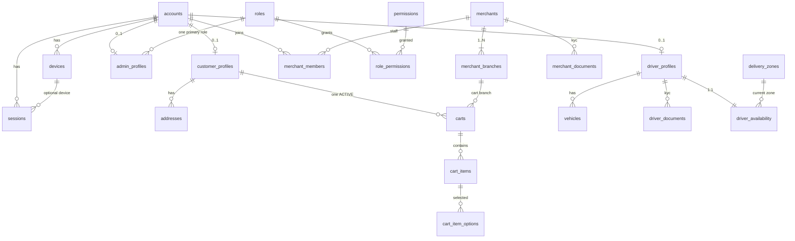
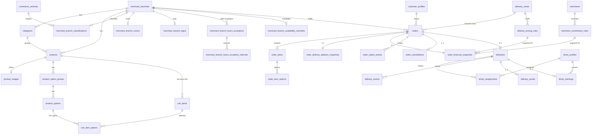
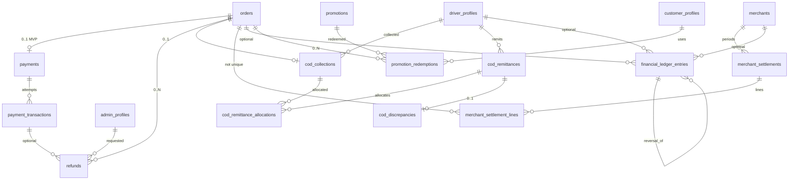
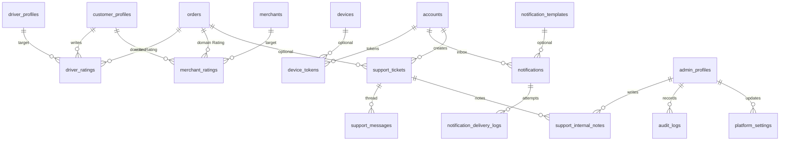

# SpeedyGo ERD v1.0

**Status: FROZEN — 1 September 2026** (v1.0 history unchanged)

**Prisma Schema v1.1 additive:** `cart_item_options` persists selected `ProductOption`s on a `CartItem`. This is a controlled evolution of Prisma Schema v1.0. It does not rewrite ERD v1.0 history.

This is the canonical **relational PostgreSQL** design derived from [Domain Model v1.0](../architecture/DOMAIN_MODEL.md).

```
SpeedyGo Domain Model v1.0
        →  ERD v1.0
        →  Prisma Schema v1.0 (`apps/backend/prisma/contract.prisma`)
        →  Prisma Schema v1.1 additive `cart_item_options`
```

The domain model remains the business source of truth. This document is the **physical relational** source of truth.

Do not invent Prisma models from this file until ERD v1.0 is accepted. Do not silently change Domain Model v1.0. Structural differences required by PostgreSQL / Prisma are listed under **ERD implementation decisions**.

Target: **PostgreSQL 16** + **PostGIS**. Future ORM: **Prisma 8**.

---

## Architectural invariants (unchanged)

1. Driver earnings ≠ COD cash collected.
2. Merchant GMS ≠ merchant commission ≠ merchant net.
3. Merchant commission ≠ delivery fee.
4. Customer delivery fee ≠ driver remuneration ≠ SpeedyGo delivery share.
5. Order status ≠ fulfillment status ≠ delivery status ≠ payment status ≠ refund status ≠ COD status.
6. Cancellation ≠ refund.
7. Historical financial snapshots are immutable.
8. Future commission / pricing changes never recalculate historical orders.
9. Backend is authoritative for money. Frontends never independently calculate authoritative financial values.

Money: **BIGINT minor units**. Rates: **INTEGER basis points**. Example: `2 200 DZD = 220000`; `7% = 700`.

---

## Conventions

### Naming

| Kind | Rule | Example |
| --- | --- | --- |
| Tables | `snake_case` plural | `order_financial_snapshots` |
| Columns | `snake_case` | `customer_id`, `amount_minor` |
| Primary key | `id` UUID, except true 1:1 extensions that use the parent key | `orders.id` · `order_financial_snapshots.order_id` |
| Foreign keys | `<entity>_id` | `order_id`, `driver_id` |

### Primary keys

- Type: `UUID`.
- Generated as **UUIDv7** in the backend (time-ordered, not a sequential business id).
- PostgreSQL 16 does not provide `uuidv7()` built-in; the application (or a later PG 17 upgrade) generates the value. Column default may be `gen_random_uuid()` only as a fallback — prefer application UUIDv7.
- Business / public references (`#SG-260803-1842`, `MER-VER-0142`, `REC-COD-…`) are **never** primary keys. They are `VARCHAR` + `UNIQUE` where required.

### Timestamps

- Absolute instants: `TIMESTAMPTZ`, stored in **UTC**.
- UI localization (Algeria / French) is a frontend concern.
- Local clock windows for pricing: `TIME` without time zone (`start_local_time`, `end_local_time`).
- Date-only expiry (documents): `DATE`.

### Money and rates

- Authoritative amounts: `BIGINT` (`*_minor`). **Never** `FLOAT` / `DOUBLE` / `REAL` / `NUMERIC` for money.
- Rates: `INTEGER` (`*_bps`).
- Non-negative `CHECK` where the amount cannot semantically go negative.
- Signed `BIGINT` only where the domain needs it (`adjustment_minor`, COD `difference_minor`, some settlement totals).

### Coordinates

- `latitude` / `longitude`: `DOUBLE PRECISION` (not money).
- Zone coverage: PostGIS `geometry(MultiPolygon, 4326)` + **GIST**.

### JSON

- Structured blobs: `JSONB` (`metadata_json`, `before_json`, `value_json`).

### IP addresses

- `INET` where stored (`sessions.ip_address`, `audit_logs.ip_address`).

---

## Enum strategy

**ERD v1.0 default: constrained `VARCHAR`, not PostgreSQL `ENUM`.**

| Choice | Use |
| --- | --- |
| `VARCHAR(64)` + `CHECK (col IN (…))` | Frozen status machines (order, fulfillment, delivery, payment, refund, driver availability) and other closed vocabularies |
| `VARCHAR(64)` **without** a frozen CHECK | Unfrozen vocabularies (COD statuses, some document types) until business confirmation |
| PostgreSQL `ENUM` | **Not used in ERD v1.0** |

Why not PG `ENUM`:

- Adding / renaming values is awkward (`ALTER TYPE`).
- Prisma enum migrations are historically brittle.
- COD names are explicitly unfrozen.

Prisma 8 should map these columns as `String` (or Prisma enums mapped to `String` / native if a later version prefers). Changing this mapping later is an ORM decision, not a domain change.

Do **not** create lookup tables for simple application states.

Complex lifecycle rules stay in backend domain services. SQL `CHECK` only encodes closed lists and simple numeric/scope invariants.

---

## Enum / VARCHAR vocabularies

### Frozen (CHECK in schema)

| Column family | Values |
| --- | --- |
| `orders.status` | `CREATED` `CONFIRMED` `ACTIVE` `COMPLETED` `CANCELLED` `FAILED` |
| `orders.fulfillment_status` | `PENDING_ACCEPTANCE` `ACCEPTED` `PREPARING` `READY` |
| `deliveries.status` | `SEARCHING_DRIVER` `DRIVER_ASSIGNED` `TO_PICKUP` `AT_PICKUP` `PICKED_UP` `IN_TRANSIT` `ARRIVED_CUSTOMER` `DELIVERED` `FAILED` `CANCELLED` |
| `payments.status` | `PENDING` `PROCESSING` `SUCCEEDED` `FAILED` `CANCELLED` |
| `refunds.status` | `REQUESTED` `UNDER_REVIEW` `APPROVED` `PROCESSING` `REFUNDED` `REJECTED` `FAILED` |
| `driver_availability.status` | `OFFLINE` `ONLINE` `OFFLINE_AFTER_CURRENT_DELIVERY` `SUSPENDED` |
| `refunds.refund_method` | `ORIGINAL_PAYMENT` `MANUAL_COD` `MANUAL_OTHER` |
| `merchant_commission_rules.scope` | `GLOBAL_DEFAULT` `MERCHANT_OVERRIDE` |
| `delivery_pricing_rules.time_band` | `DAY` `NIGHT` `CUSTOM` |
| `merchant_settlement_lines.type` | `SALE` `REFUND_ADJUSTMENT` `MANUAL_ADJUSTMENT` `REVERSAL` |
| `promotion_redemptions.funded_by` | `SPEEDYGO` `MERCHANT` `SHARED` |
| `financial_ledger_entries.direction` | `DEBIT` `CREDIT` |
| `carts.status` | `ACTIVE` `ABANDONED` `CONVERTED` |

### Documented, not frozen as CHECK

COD collection / remittance / discrepancy status names remain **REQUIRES BUSINESS CONFIRMATION**. Store as `VARCHAR(64)`. Placeholder names from [STATE_MACHINES.md](../architecture/STATE_MACHINES.md): `NOT_APPLICABLE` `EXPECTED` `COLLECTED` `DECLARED` `REMITTED` `SETTLED` `DISCREPANCY`.

Other open codes (account status, merchant status, payment method, assignment status, document type, vehicle type, promotion type, ledger `type`, support status/priority, notification channel): `VARCHAR(64)` with application-level enums. Add a CHECK only when the list is frozen.

Suggested ledger `type` values (not a CHECK yet): `CUSTOMER_PAYMENT` `MERCHANT_PAYABLE` `MERCHANT_COMMISSION` `DRIVER_PAYABLE` `DELIVERY_REVENUE` `SERVICE_FEE` `COD_CUSTODY` `REFUND` `ADJUSTMENT` `REVERSAL`.

---

## Concepts that are not PostgreSQL tables

| Domain / UI concept | Persistence |
| --- | --- |
| `DriverLiveLocation` | Redis / realtime. Keyed by `driver_id`. Not in ERD v1.0. A future historical GPS table would be a new, explicit design. |
| Timer / Countdown / Chronometer | Derived in UI from `order_status_events`, `delivery_events`, `deliveries.estimated_arrival_at` |
| High-demand notification | Detection event → notification service → `notification_templates` / `notifications` |
| Active cart (domain 0..1) | Same `carts` row; enforced by `status = ACTIVE` + partial unique index |
| Domain `Rating` | One business concept; **two tables** for FK integrity (see implementation decision) |

---

# ERD implementation decisions

These are relational/technical choices. They do **not** change Domain Model v1.0 meaning.

### 1. Ratings split into two tables

PostgreSQL cannot FK `target_id` to both `driver_profiles` and `merchants`.

| Domain | ERD |
| --- | --- |
| One `Rating` with `targetType` + `targetId` | `driver_ratings` and `merchant_ratings` |

Each row still belongs to one Order and one Customer. Application services expose one Rating concept.

`UNIQUE (order_id, customer_id)` on each table: one driver rating and one merchant rating per customer per order.

### 2. Cart status column

Domain: at most one **active** Cart. ERD adds `carts.status` (`ACTIVE` / `ABANDONED` / `CONVERTED`) plus:

```sql
CREATE UNIQUE INDEX carts_one_active_per_customer
  ON carts (customer_id) WHERE status = 'ACTIVE';
```

### 3. One default address

```sql
CREATE UNIQUE INDEX addresses_one_default_per_customer
  ON addresses (customer_id) WHERE is_default;
```

### 4. Vehicle plate uniqueness

Plates can be reused over a vehicle’s life (sold, re-registered). **Not** globally unique.

```sql
CREATE UNIQUE INDEX vehicles_active_plate_uq
  ON vehicles (plate_number) WHERE status = 'ACTIVE';
```

### 5. One current driver assignment per delivery (and per driver)

History allows many `driver_assignments`. Current assignment = `released_at IS NULL`.

```sql
CREATE UNIQUE INDEX driver_assignments_one_open_per_delivery
  ON driver_assignments (delivery_id) WHERE released_at IS NULL;

CREATE UNIQUE INDEX driver_assignments_one_open_per_driver
  ON driver_assignments (driver_id) WHERE released_at IS NULL;
```

Assignment `status` is application-level (`OFFERED` / `ACCEPTED` / `RELEASED` / `EXPIRED` suggested, not frozen).

### 6. Overlapping commission and pricing rules

The domain does **not** freeze precedence beyond: merchant override else global default; snapshot at order creation.

ERD v1.0 does **not** add PostgreSQL `EXCLUDE` constraints (Prisma cannot express them cleanly).

**Enforcement:** backend validation at rule write time. Optional later hardening: `tstzrange` + `EXCLUDE USING gist`.

Deactivate rules (`active = false`); never delete a rule referenced by `order_financial_snapshots`.

### 7. Commission snapshot FKs are required

`order_financial_snapshots.commission_rule_id` and `pricing_rule_id` are **NOT NULL** `RESTRICT` FKs so every order points at the exact rule used. Retire rules; do not delete them.

### 8. Audit `session_id` is not an FK

Sessions are revoked and may be purged. `audit_logs.session_id` is nullable `UUID` **without** FK so audit history cannot block session cleanup.

### 9. Platform settings are a current-value store

`platform_settings` is upserted by `key`. Historical mutations go to **`audit_logs`**. No settings-version table.

Dated money configuration still belongs on `merchant_commission_rules` / `delivery_pricing_rules`, not in settings.

### 10. Product `category_id` is required

Domain lists `categoryId` and `Category 1 → many Product`. ERD: `products.category_id NOT NULL`. Uncategorized catalogs use a branch default category. Category delete is `RESTRICT`.

### 11. Ledger direction

Domain `direction` is stored as `DEBIT` | `CREDIT`. `amount_minor >= 0`. Sign lives in `direction`, not in the amount.

### 12. Signed financial columns

| Column | Signed? |
| --- | --- |
| Most `*_minor` amounts | No (`CHECK >= 0`) |
| `driver_earnings.adjustment_minor` | **Yes** |
| `driver_earnings.net_earning_minor` | **Yes** (penalties may exceed base + bonus) |
| `cod_discrepancies.difference_minor` | **Yes** (`confirmed - expected`) |
| `merchant_settlements.refund_adjustments_minor` | **Yes** |
| `merchant_settlements.manual_adjustments_minor` | **Yes** |
| `merchant_settlements.net_payable_minor` | **Yes** (merchant may owe the platform) |
| `merchant_settlement_lines.adjustment_minor` | **Yes** |
| `merchant_settlement_lines.merchant_net_minor` | **Yes** on adjustment lines |

`driver_earnings.bonus_minor` and `base_remuneration_minor` stay `>= 0`.

### 13. Phone / email uniqueness

Both nullable. Partial unique indexes when present. No CHECK requiring phone or email (identity strategy still open). Mobile is expected to be phone-first at application level.

### 14. Refund method vs `payment_transaction_id`

Not encoded as SQL CHECK (Prisma / multi-column CHECKs are brittle). **Application validation:**

- `ORIGINAL_PAYMENT` → `payment_transaction_id` required
- `MANUAL_COD` / `MANUAL_OTHER` → `payment_transaction_id` null

### 15. `offline_after_current_delivery` vs availability status

Both columns exist (domain). Status is the machine; the boolean is the driver’s stored intent. Keep both.

---

# Relational tables (62)

## 1. Identity & access

### `accounts`

| Column | Type | Null | Notes |
| --- | --- | --- | --- |
| id | UUID | NO | PK, UUIDv7 |
| phone | VARCHAR(32) | YES | Partial UNIQUE |
| email | VARCHAR(255) | YES | Partial UNIQUE |
| status | VARCHAR(64) | NO | Application vocabulary |
| created_at | TIMESTAMPTZ | NO | |
| updated_at | TIMESTAMPTZ | NO | |

### `sessions`

| Column | Type | Null | Notes |
| --- | --- | --- | --- |
| id | UUID | NO | PK |
| account_id | UUID | NO | FK → accounts RESTRICT |
| refresh_token_hash | VARCHAR(255) | NO | UNIQUE |
| device_id | UUID | YES | FK → devices SET NULL |
| ip_address | INET | YES | |
| expires_at | TIMESTAMPTZ | NO | |
| revoked_at | TIMESTAMPTZ | YES | |
| created_at | TIMESTAMPTZ | NO | |

### `devices`

| Column | Type | Null | Notes |
| --- | --- | --- | --- |
| id | UUID | NO | PK |
| account_id | UUID | NO | FK → accounts RESTRICT |
| platform | VARCHAR(32) | NO | ios / android / web |
| app_version | VARCHAR(32) | NO | |
| device_name | VARCHAR(128) | YES | |
| last_seen_at | TIMESTAMPTZ | NO | |
| created_at | TIMESTAMPTZ | NO | |

### `customer_profiles`

| Column | Type | Null | Notes |
| --- | --- | --- | --- |
| id | UUID | NO | PK |
| account_id | UUID | NO | UNIQUE FK → accounts RESTRICT |
| full_name | VARCHAR(255) | NO | |
| avatar_url | TEXT | YES | |
| created_at | TIMESTAMPTZ | NO | |
| updated_at | TIMESTAMPTZ | NO | |

### `driver_profiles`

| Column | Type | Null | Notes |
| --- | --- | --- | --- |
| id | UUID | NO | PK |
| account_id | UUID | NO | UNIQUE FK → accounts RESTRICT |
| full_name | VARCHAR(255) | NO | |
| verification_status | VARCHAR(64) | NO | |
| approved_at | TIMESTAMPTZ | YES | |
| created_at | TIMESTAMPTZ | NO | |
| updated_at | TIMESTAMPTZ | NO | |

### `admin_profiles`

| Column | Type | Null | Notes |
| --- | --- | --- | --- |
| id | UUID | NO | PK |
| account_id | UUID | NO | UNIQUE FK → accounts RESTRICT |
| role_id | UUID | NO | FK → roles RESTRICT |
| display_name | VARCHAR(255) | NO | |
| two_factor_enabled | BOOLEAN | NO | DEFAULT false |
| created_at | TIMESTAMPTZ | NO | |
| updated_at | TIMESTAMPTZ | NO | |

One primary role per admin (domain v1.0).

### `roles`

| Column | Type | Null | Notes |
| --- | --- | --- | --- |
| id | UUID | NO | PK |
| name | VARCHAR(128) | NO | UNIQUE |
| description | TEXT | YES | |
| active | BOOLEAN | NO | DEFAULT true |

### `permissions`

| Column | Type | Null | Notes |
| --- | --- | --- | --- |
| id | UUID | NO | PK |
| code | VARCHAR(128) | NO | UNIQUE |
| description | TEXT | YES | |

### `role_permissions`

| Column | Type | Null | Notes |
| --- | --- | --- | --- |
| role_id | UUID | NO | FK → roles CASCADE |
| permission_id | UUID | NO | FK → permissions RESTRICT |

PK: `(role_id, permission_id)`.

---

## 2. Customer

### `addresses`

| Column | Type | Null | Notes |
| --- | --- | --- | --- |
| id | UUID | NO | PK |
| customer_id | UUID | NO | FK → customer_profiles RESTRICT |
| label | VARCHAR(64) | NO | |
| address_text | TEXT | NO | |
| latitude | DOUBLE PRECISION | NO | |
| longitude | DOUBLE PRECISION | NO | |
| is_default | BOOLEAN | NO | DEFAULT false |
| created_at | TIMESTAMPTZ | NO | |
| updated_at | TIMESTAMPTZ | NO | |

Partial UNIQUE `(customer_id) WHERE is_default`.

### `carts`

| Column | Type | Null | Notes |
| --- | --- | --- | --- |
| id | UUID | NO | PK |
| customer_id | UUID | NO | FK → customer_profiles RESTRICT |
| merchant_branch_id | UUID | NO | FK → merchant_branches RESTRICT |
| status | VARCHAR(32) | NO | ACTIVE / ABANDONED / CONVERTED |
| created_at | TIMESTAMPTZ | NO | |
| updated_at | TIMESTAMPTZ | NO | |

Cart line prices are **not** authoritative.

### `cart_items`

| Column | Type | Null | Notes |
| --- | --- | --- | --- |
| id | UUID | NO | PK |
| cart_id | UUID | NO | FK → carts CASCADE |
| product_id | UUID | NO | FK → products RESTRICT |
| quantity | INTEGER | NO | CHECK > 0 |
| unit_price_minor | BIGINT | NO | CHECK >= 0 |
| created_at | TIMESTAMPTZ | NO | |
| updated_at | TIMESTAMPTZ | NO | |

`unit_price_minor` is a last-write merchandise hint. Live Catalog remains authoritative while Cart is mutable.

### `cart_item_options`

Join table for persisted Cart configuration. A CartItem may have zero or many selected ProductOptions. The same ProductOption may appear at most once on the same CartItem.

This relation exists so Cart configuration survives API requests and is available to Cart bootstrap, live price calculation, readiness validation, future Checkout, and future Order snapshot creation. It stores **no** price snapshots, option names, product names, merchant IDs, or branch IDs.

| Column | Type | Null | Notes |
| --- | --- | --- | --- |
| id | UUID | NO | PK, UUIDv7 |
| cart_item_id | UUID | NO | FK → cart_items CASCADE |
| product_option_id | UUID | NO | FK → product_options CASCADE (join row only; does not delete cart_items) |
| created_at | TIMESTAMPTZ | NO | |

UNIQUE `(cart_item_id, product_option_id)`.

---

## 3. Merchant

### `merchants`

| Column | Type | Null | Notes |
| --- | --- | --- | --- |
| id | UUID | NO | PK |
| public_reference | VARCHAR(64) | NO | UNIQUE |
| name | VARCHAR(255) | NO | |
| status | VARCHAR(64) | NO | |
| verified_at | TIMESTAMPTZ | YES | |
| created_at | TIMESTAMPTZ | NO | |
| updated_at | TIMESTAMPTZ | NO | |

### `merchant_branches`

| Column | Type | Null | Notes |
| --- | --- | --- | --- |
| id | UUID | NO | PK |
| merchant_id | UUID | NO | FK → merchants RESTRICT |
| name | VARCHAR(255) | NO | |
| phone | VARCHAR(32) | NO | |
| address_text | TEXT | NO | |
| latitude | DOUBLE PRECISION | NO | |
| longitude | DOUBLE PRECISION | NO | |
| wilaya_code | VARCHAR(2) | YES | FK → wilayas RESTRICT; leading zeros preserved |
| commune_id | INTEGER | YES | FK → communes RESTRICT; SpeedyGo catalogue id |
| operational_status | VARCHAR(64) | NO | |
| created_at | TIMESTAMPTZ | NO | |
| updated_at | TIMESTAMPTZ | NO | |

Domain: Merchant has 1..many branches. Enforced in application (at least one branch). No DB CHECK for minimum count.  
CHECK: `(wilaya_code IS NULL AND commune_id IS NULL) OR (wilaya_code IS NOT NULL AND commune_id IS NOT NULL)`. Application also enforces commune.wilaya_code = branch.wilaya_code.

### `wilayas`

| Column | Type | Null | Notes |
| --- | --- | --- | --- |
| code | VARCHAR(2) | NO | PK (`01`…`69`) |
| name_fr | VARCHAR(255) | NO | |
| name_ar | VARCHAR(255) | NO | |
| created_at | TIMESTAMPTZ | NO | |
| updated_at | TIMESTAMPTZ | NO | |

### `communes`

| Column | Type | Null | Notes |
| --- | --- | --- | --- |
| id | INTEGER | NO | PK — SpeedyGo Algeria catalogue id (not ONS) |
| wilaya_code | VARCHAR(2) | NO | FK → wilayas RESTRICT |
| name_fr | VARCHAR(255) | NO | |
| name_ar | VARCHAR(255) | NO | |
| aliases_fr | TEXT | YES | JSON array of French aliases for search |
| created_at | TIMESTAMPTZ | NO | |
| updated_at | TIMESTAMPTZ | NO | |

INDEX `(wilaya_code)`.

### `merchant_members`

| Column | Type | Null | Notes |
| --- | --- | --- | --- |
| id | UUID | NO | PK |
| merchant_id | UUID | NO | FK → merchants RESTRICT |
| account_id | UUID | NO | FK → accounts RESTRICT |
| role | VARCHAR(64) | NO | Application vocabulary |
| created_at | TIMESTAMPTZ | NO | |

UNIQUE `(merchant_id, account_id)`.

### `merchant_documents`

| Column | Type | Null | Notes |
| --- | --- | --- | --- |
| id | UUID | NO | PK |
| merchant_id | UUID | NO | FK → merchants RESTRICT |
| type | VARCHAR(64) | NO | |
| file_url | TEXT | NO | |
| status | VARCHAR(64) | NO | |
| expiry_date | DATE | YES | |
| created_at | TIMESTAMPTZ | NO | |
| updated_at | TIMESTAMPTZ | NO | |

`file_url` is a private verification locator (`sg-object:v1:…`). Never a Customer-reachable cover URL.

### `commerce_verticals`

Platform Home taxonomy. Not branch menu `categories`.

| Column | Type | Null | Notes |
| --- | --- | --- | --- |
| id | UUID | NO | PK |
| slug | VARCHAR(64) | NO | UNIQUE |
| name | VARCHAR(255) | NO | |
| icon_key | VARCHAR(64) | NO | Application allowlist |
| sort_order | INTEGER | NO | CHECK >= 0 |
| active | BOOLEAN | NO | |
| created_at | TIMESTAMPTZ | NO | |
| updated_at | TIMESTAMPTZ | NO | |

### `merchant_branch_classifications`

Explicit 0..1 vertical assignment per branch.

| Column | Type | Null | Notes |
| --- | --- | --- | --- |
| id | UUID | NO | PK |
| branch_id | UUID | NO | FK → merchant_branches RESTRICT, UNIQUE |
| vertical_id | UUID | NO | FK → commerce_verticals RESTRICT |
| created_at | TIMESTAMPTZ | NO | |
| updated_at | TIMESTAMPTZ | NO | |

Deactivating a vertical does not delete this row and does not hide the branch from the unfiltered Customer storefront list.

### `merchant_branch_covers`

One public storefront cover per branch. Bytes live under ObjectStorage namespace `covers/`, locator `sg-cover:v1:<32-hex>`. Never `permanent/` verification objects.

| Column | Type | Null | Notes |
| --- | --- | --- | --- |
| id | UUID | NO | PK |
| branch_id | UUID | NO | FK → merchant_branches RESTRICT, UNIQUE |
| object_id | VARCHAR(64) | NO | Opaque hex object id |
| content_type | VARCHAR(64) | NO | image/jpeg or image/png |
| byte_size | INTEGER | NO | CHECK > 0 |
| width_px | INTEGER | NO | CHECK > 0 |
| height_px | INTEGER | NO | CHECK > 0 |
| created_at | TIMESTAMPTZ | NO | |
| updated_at | TIMESTAMPTZ | NO | |

### `merchant_branch_logos`

One optional storefront logo per branch, scoped like `merchant_branch_covers`. Read only through authenticated Merchant routes (no Customer projection). Bytes live under ObjectStorage namespace `logos/`, locator `sg-logo:v1:<32-hex>`. Never `covers/`, `product-images/` or `permanent/` objects. Added by migration `20261002T1907_merchant_contract_completion_batch` (unique constraint `merchant_branch_logos_branch_id_key`).

| Column | Type | Null | Notes |
| --- | --- | --- | --- |
| id | UUID | NO | PK |
| branch_id | UUID | NO | FK → merchant_branches RESTRICT, UNIQUE |
| object_id | VARCHAR(64) | NO | Opaque hex object id; a new id on every replacement |
| content_type | VARCHAR(64) | NO | image/jpeg or image/png |
| byte_size | INTEGER | NO | CHECK > 0 |
| width_px | INTEGER | NO | CHECK > 0 |
| height_px | INTEGER | NO | CHECK > 0 |
| created_at | TIMESTAMPTZ | NO | |
| updated_at | TIMESTAMPTZ | NO | |

### `merchant_branch_availability_overrides`

One optional Merchant-controlled availability override per branch (1:1 with `merchant_branches`). Independent of `operational_status` and of weekly opening schedules.

| Column | Type | Null | Notes |
| --- | --- | --- | --- |
| id | UUID | NO | PK |
| branch_id | UUID | NO | FK → merchant_branches RESTRICT, UNIQUE |
| mode | VARCHAR(32) | NO | `FOLLOW_SCHEDULE` \| `FORCE_CLOSED` \| `TEMPORARY_CLOSED` |
| reason_code | VARCHAR(64) | YES | Allowlisted vocabulary |
| customer_message | VARCHAR(500) | YES | Optional customer-facing text |
| closed_until | TIMESTAMPTZ | YES | Required iff `TEMPORARY_CLOSED` |
| version | INTEGER | NO | ≥ 1 optimistic concurrency |
| updated_by_account_id | UUID | NO | FK → accounts RESTRICT |
| created_at | TIMESTAMPTZ | NO | |
| updated_at | TIMESTAMPTZ | NO | |

### `merchant_branch_hours_exceptions`

Per-date replacement of the weekly opening schedule (`merchant_branch_opening_schedules` / `merchant_branch_opening_intervals`, which are unchanged). `local_date` is an `Africa/Algiers` civil date.

| Column | Type | Null | Notes |
| --- | --- | --- | --- |
| id | UUID | NO | PK |
| branch_id | UUID | NO | FK → merchant_branches RESTRICT |
| local_date | DATE | NO | Civil date in Africa/Algiers |
| closed | BOOLEAN | NO | true = closed all day (no intervals) |
| label | VARCHAR(80) | NO | CHECK non-blank; Merchant-facing reason |
| customer_message | VARCHAR(500) | YES | Optional |
| version | INTEGER | NO | ≥ 1 optimistic concurrency |
| updated_by_account_id | UUID | NO | FK → accounts RESTRICT |
| created_at | TIMESTAMPTZ | NO | |
| updated_at | TIMESTAMPTZ | NO | |

UNIQUE index `(branch_id, local_date)`. Indexes `(branch_id)` and `(updated_by_account_id)`. CHECKs: `length(btrim(label)) > 0`, `version >= 1`. Added by migration `20261002T1907_merchant_contract_completion_batch`.

### `merchant_branch_hours_exception_intervals`

| Column | Type | Null | Notes |
| --- | --- | --- | --- |
| id | UUID | NO | PK |
| exception_id | UUID | NO | FK → merchant_branch_hours_exceptions CASCADE |
| opens_minute | INTEGER | NO | 0..1439 |
| closes_minute | INTEGER | NO | 0..1439 |
| closes_next_day | BOOLEAN | NO | true only when the interval ends exactly at midnight (`closes_minute = 0`) |
| sort_order | INTEGER | NO | CHECK >= 0 |
| created_at | TIMESTAMPTZ | NO | |

CHECK `(closes_next_day = false AND closes_minute > opens_minute) OR (closes_next_day = true AND closes_minute = 0)`: exception intervals never continue into the next date. Indexes `(exception_id, sort_order)` and `(exception_id)`.

---

## 4. Catalog

### `categories`

| Column | Type | Null | Notes |
| --- | --- | --- | --- |
| id | UUID | NO | PK |
| merchant_branch_id | UUID | NO | FK → merchant_branches RESTRICT |
| name | VARCHAR(255) | NO | |
| sort_order | INTEGER | NO | DEFAULT 0 |
| active | BOOLEAN | NO | DEFAULT true |
| created_at | TIMESTAMPTZ | NO | |
| updated_at | TIMESTAMPTZ | NO | |

### `products`

| Column | Type | Null | Notes |
| --- | --- | --- | --- |
| id | UUID | NO | PK |
| merchant_branch_id | UUID | NO | FK → merchant_branches RESTRICT |
| category_id | UUID | NO | FK → categories RESTRICT |
| name | VARCHAR(255) | NO | |
| description | TEXT | YES | |
| price_minor | BIGINT | NO | CHECK >= 0 |
| available | BOOLEAN | NO | DEFAULT true |
| created_at | TIMESTAMPTZ | NO | |
| updated_at | TIMESTAMPTZ | NO | |
| duplicate_request_key | VARCHAR(64) | YES | UNIQUE (`products_duplicate_request_key_key`). SHA-256 hex of `sourceProductId:lowercase(requestId)`; set only on copies made by duplication; never returned by the API |

Application should ensure `category.merchant_branch_id = product.merchant_branch_id`.

### `product_images`

One optional photograph per product. Bytes live under ObjectStorage namespace `product-images/`, locator `sg-product-image:v1:<32-hex>`. Never `permanent/` verification objects or `covers/` storefront covers.

| Column | Type | Null | Notes |
| --- | --- | --- | --- |
| id | UUID | NO | PK |
| product_id | UUID | NO | FK → products CASCADE, UNIQUE |
| object_id | VARCHAR(64) | NO | Opaque hex object id |
| content_type | VARCHAR(64) | NO | image/jpeg or image/png |
| byte_size | INTEGER | NO | CHECK > 0 |
| width_px | INTEGER | NO | CHECK > 0 |
| height_px | INTEGER | NO | CHECK > 0 |
| created_at | TIMESTAMPTZ | NO | |
| updated_at | TIMESTAMPTZ | NO | |

### `product_option_groups`

| Column | Type | Null | Notes |
| --- | --- | --- | --- |
| id | UUID | NO | PK |
| product_id | UUID | NO | FK → products CASCADE |
| name | VARCHAR(255) | NO | |
| required | BOOLEAN | NO | |
| min_selections | INTEGER | NO | CHECK >= 0 |
| max_selections | INTEGER | NO | CHECK >= min_selections |
| created_at | TIMESTAMPTZ | NO | |
| updated_at | TIMESTAMPTZ | NO | |

### `product_options`

| Column | Type | Null | Notes |
| --- | --- | --- | --- |
| id | UUID | NO | PK |
| option_group_id | UUID | NO | FK → product_option_groups CASCADE |
| name | VARCHAR(255) | NO | |
| additional_price_minor | BIGINT | NO | CHECK >= 0 |
| available | BOOLEAN | NO | DEFAULT true |
| created_at | TIMESTAMPTZ | NO | |
| updated_at | TIMESTAMPTZ | NO | |

---

## 5. Driver & vehicle

### `vehicles`

| Column | Type | Null | Notes |
| --- | --- | --- | --- |
| id | UUID | NO | PK |
| driver_id | UUID | NO | FK → driver_profiles RESTRICT |
| type | VARCHAR(64) | NO | |
| plate_number | VARCHAR(32) | NO | Partial UNIQUE when ACTIVE |
| model | VARCHAR(128) | NO | |
| color | VARCHAR(64) | YES | |
| status | VARCHAR(64) | NO | |
| created_at | TIMESTAMPTZ | NO | |
| updated_at | TIMESTAMPTZ | NO | |

### `driver_documents`

| Column | Type | Null | Notes |
| --- | --- | --- | --- |
| id | UUID | NO | PK |
| driver_id | UUID | NO | FK → driver_profiles RESTRICT |
| type | VARCHAR(64) | NO | |
| file_url | TEXT | NO | |
| status | VARCHAR(64) | NO | |
| expiry_date | DATE | YES | |
| created_at | TIMESTAMPTZ | NO | |
| updated_at | TIMESTAMPTZ | NO | |

### `driver_availability`

| Column | Type | Null | Notes |
| --- | --- | --- | --- |
| driver_id | UUID | NO | PK, FK → driver_profiles CASCADE |
| status | VARCHAR(64) | NO | Frozen availability CHECK |
| current_zone_id | UUID | YES | FK → delivery_zones SET NULL |
| offline_after_current_delivery | BOOLEAN | NO | DEFAULT false |
| updated_at | TIMESTAMPTZ | NO | |

1:1 composition with driver. Create the row when the driver profile is created.

Live GPS is **not** stored here.

---

## 6. Geography & pricing

### `delivery_zones`

| Column | Type | Null | Notes |
| --- | --- | --- | --- |
| id | UUID | NO | PK |
| name | VARCHAR(255) | NO | |
| geometry | geometry(MultiPolygon, 4326) | NO | GIST |
| active | BOOLEAN | NO | DEFAULT true |
| created_at | TIMESTAMPTZ | NO | |
| updated_at | TIMESTAMPTZ | NO | |

Orders store `delivery_zone_id` as the **resolved** zone at creation. Later geometry edits do not rewrite that FK.

Prisma later: `Unsupported("geometry")` (or equivalent) plus a raw SQL migration for PostGIS.

### `delivery_pricing_rules`

| Column | Type | Null | Notes |
| --- | --- | --- | --- |
| id | UUID | NO | PK |
| zone_id | UUID | NO | FK → delivery_zones RESTRICT |
| name | VARCHAR(255) | NO | |
| time_band | VARCHAR(32) | NO | DAY / NIGHT / CUSTOM |
| start_local_time | TIME | YES | Required in app when CUSTOM |
| end_local_time | TIME | YES | May wrap midnight — app rule |
| customer_delivery_fee_minor | BIGINT | NO | CHECK >= 0 |
| driver_remuneration_minor | BIGINT | NO | CHECK >= 0 |
| effective_from | TIMESTAMPTZ | NO | |
| effective_to | TIMESTAMPTZ | YES | CHECK > effective_from if set |
| active | BOOLEAN | NO | DEFAULT true |
| created_at | TIMESTAMPTZ | NO | |
| updated_at | TIMESTAMPTZ | NO | |

SpeedyGo delivery share is **not** a column here. It is computed at snapshot time onto `order_financial_snapshots`.

### `merchant_commission_rules`

| Column | Type | Null | Notes |
| --- | --- | --- | --- |
| id | UUID | NO | PK |
| scope | VARCHAR(32) | NO | GLOBAL_DEFAULT / MERCHANT_OVERRIDE |
| merchant_id | UUID | YES | FK → merchants RESTRICT |
| rate_bps | INTEGER | NO | CHECK 0..10000 |
| effective_from | TIMESTAMPTZ | NO | |
| effective_to | TIMESTAMPTZ | YES | CHECK > effective_from if set |
| change_reason | TEXT | YES | |
| changed_by_admin_id | UUID | NO | FK → admin_profiles RESTRICT |
| active | BOOLEAN | NO | DEFAULT true |
| created_at | TIMESTAMPTZ | NO | |

```sql
CHECK (
  (scope = 'GLOBAL_DEFAULT' AND merchant_id IS NULL)
  OR
  (scope = 'MERCHANT_OVERRIDE' AND merchant_id IS NOT NULL)
)
```

---

## 7. Order

### `orders`

| Column | Type | Null | Notes |
| --- | --- | --- | --- |
| id | UUID | NO | PK |
| public_reference | VARCHAR(64) | NO | UNIQUE |
| customer_id | UUID | NO | FK → customer_profiles RESTRICT |
| merchant_branch_id | UUID | NO | FK → merchant_branches RESTRICT |
| delivery_zone_id | UUID | NO | FK → delivery_zones RESTRICT |
| status | VARCHAR(32) | NO | OrderStatus CHECK |
| fulfillment_status | VARCHAR(32) | NO | FulfillmentStatus CHECK |
| created_at | TIMESTAMPTZ | NO | |
| confirmed_at | TIMESTAMPTZ | YES | |
| completed_at | TIMESTAMPTZ | YES | |
| updated_at | TIMESTAMPTZ | NO | |
| preparation_minutes | INTEGER | YES | Minutes chosen at accept; informational after revisions |
| original_preparation_minutes | INTEGER | YES | Immutable copy of accept minutes |
| estimated_ready_at | TIMESTAMPTZ | YES | Current prep ready estimate (server clock) |
| original_estimated_ready_at | TIMESTAMPTZ | YES | First estimate; never rewritten |
| preparation_estimate_version | INTEGER | NO | Optimistic concurrency; 0 = no estimate |

Do **not** store payment, refund, delivery, or COD status on this table. Preparation estimate ≠ Delivery arrival ETA.

### `order_preparation_estimate_revisions`

| Column | Type | Null | Notes |
| --- | --- | --- | --- |
| id | UUID | NO | PK |
| order_id | UUID | NO | FK → orders RESTRICT |
| revision_number | INTEGER | NO | 1 = initial accept estimate |
| previous_estimated_ready_at | TIMESTAMPTZ | YES | Null on first revision |
| new_estimated_ready_at | TIMESTAMPTZ | NO | |
| add_minutes | INTEGER | NO | Minutes added (accept = preparationMinutes) |
| reason | VARCHAR(255) | YES | Optional free text |
| actor_account_id | UUID | NO | Merchant account |
| created_at | TIMESTAMPTZ | NO | |

UNIQUE `(order_id, revision_number)`. Append-only.

### `order_items`

| Column | Type | Null | Notes |
| --- | --- | --- | --- |
| id | UUID | NO | PK |
| order_id | UUID | NO | FK → orders RESTRICT |
| product_id | UUID | YES | FK → products SET NULL |
| product_name_snapshot | VARCHAR(255) | NO | Immutable copy |
| quantity | INTEGER | NO | CHECK > 0 |
| unit_price_minor | BIGINT | NO | CHECK >= 0 |
| line_total_minor | BIGINT | NO | CHECK >= 0 |

### `order_item_options`

| Column | Type | Null | Notes |
| --- | --- | --- | --- |
| id | UUID | NO | PK |
| order_item_id | UUID | NO | FK → order_items RESTRICT |
| option_name_snapshot | VARCHAR(255) | NO | |
| additional_price_minor | BIGINT | NO | CHECK >= 0 |

No live FK to `product_options` — catalog options may disappear.

### `order_delivery_address_snapshots`

| Column | Type | Null | Notes |
| --- | --- | --- | --- |
| order_id | UUID | NO | PK, FK → orders RESTRICT |
| address_text | TEXT | NO | |
| latitude | DOUBLE PRECISION | NO | |
| longitude | DOUBLE PRECISION | NO | |
| instructions | TEXT | YES | |

Immutable. Orders must not rely on mutable `addresses` as the sole delivery location.

### `order_status_events`

| Column | Type | Null | Notes |
| --- | --- | --- | --- |
| id | UUID | NO | PK |
| order_id | UUID | NO | FK → orders RESTRICT |
| event_type | VARCHAR(64) | NO | |
| actor_type | VARCHAR(32) | NO | CUSTOMER / MERCHANT / DRIVER / ADMIN / SYSTEM |
| actor_id | UUID | YES | No polymorphic FK |
| from_status | VARCHAR(32) | YES | |
| to_status | VARCHAR(32) | NO | |
| occurred_at | TIMESTAMPTZ | NO | |
| metadata_json | JSONB | YES | |

Append-only. Index `(order_id, occurred_at)`.

### `order_cancellations`

| Column | Type | Null | Notes |
| --- | --- | --- | --- |
| id | UUID | NO | PK |
| order_id | UUID | NO | UNIQUE FK → orders RESTRICT |
| reason | VARCHAR(255) | NO | |
| internal_note | TEXT | YES | |
| cancelled_by_account_id | UUID | YES | FK → accounts SET NULL |
| cancelled_at | TIMESTAMPTZ | NO | |

Not a refund.

### `order_financial_snapshots`

| Column | Type | Null | Notes |
| --- | --- | --- | --- |
| order_id | UUID | NO | PK, FK → orders RESTRICT |
| currency | CHAR(3) | NO | e.g. DZD |
| gross_merchandise_subtotal_minor | BIGINT | NO | CHECK >= 0 |
| merchant_discount_minor | BIGINT | NO | CHECK >= 0 |
| platform_discount_minor | BIGINT | NO | CHECK >= 0 |
| total_discount_minor | BIGINT | NO | CHECK >= 0 |
| commission_base_minor | BIGINT | NO | CHECK >= 0 |
| merchant_commission_rate_bps | INTEGER | NO | CHECK 0..10000 |
| merchant_commission_amount_minor | BIGINT | NO | CHECK >= 0 |
| merchant_net_amount_minor | BIGINT | NO | CHECK >= 0 |
| customer_delivery_fee_minor | BIGINT | NO | CHECK >= 0 |
| driver_remuneration_minor | BIGINT | NO | CHECK >= 0 |
| speedygo_delivery_share_minor | BIGINT | NO | CHECK >= 0 |
| service_fee_minor | BIGINT | NO | CHECK >= 0 |
| customer_payable_minor | BIGINT | NO | CHECK >= 0 |
| commission_rule_id | UUID | NO | FK → merchant_commission_rules **RESTRICT** |
| pricing_rule_id | UUID | NO | FK → delivery_pricing_rules **RESTRICT** |
| created_at | TIMESTAMPTZ | NO | |

**1:1 with `orders`.** Immutable in normal operations. Corrections use Refund, settlement lines, and ledger reversals — never silent UPDATE of these amounts.

Which discounts reduce `commission_base_minor` remains **REQUIRES BUSINESS CONFIRMATION**. The columns exist so either rule can be snapshotted without a migration.

---

## 8. Delivery

### `deliveries`

| Column | Type | Null | Notes |
| --- | --- | --- | --- |
| id | UUID | NO | PK |
| order_id | UUID | NO | UNIQUE FK → orders RESTRICT |
| status | VARCHAR(32) | NO | DeliveryStatus CHECK |
| driver_search_started_at | TIMESTAMPTZ | YES | |
| picked_up_at | TIMESTAMPTZ | YES | |
| estimated_arrival_at | TIMESTAMPTZ | YES | |
| arrived_customer_at | TIMESTAMPTZ | YES | |
| delivered_at | TIMESTAMPTZ | YES | |
| created_at | TIMESTAMPTZ | NO | |
| updated_at | TIMESTAMPTZ | NO | |

Order 1 → 0..1 Delivery. Assignment is **not** on `orders`.

### `driver_assignments`

| Column | Type | Null | Notes |
| --- | --- | --- | --- |
| id | UUID | NO | PK |
| delivery_id | UUID | NO | FK → deliveries RESTRICT |
| driver_id | UUID | NO | FK → driver_profiles RESTRICT |
| status | VARCHAR(64) | NO | Application vocabulary |
| assigned_at | TIMESTAMPTZ | NO | |
| accepted_at | TIMESTAMPTZ | YES | |
| released_at | TIMESTAMPTZ | YES | |

Many historical rows. At most one open row per delivery and per driver (partial unique indexes).

### `delivery_events`

| Column | Type | Null | Notes |
| --- | --- | --- | --- |
| id | UUID | NO | PK |
| delivery_id | UUID | NO | FK → deliveries RESTRICT |
| type | VARCHAR(64) | NO | |
| driver_id | UUID | YES | FK → driver_profiles SET NULL |
| occurred_at | TIMESTAMPTZ | NO | |
| metadata_json | JSONB | YES | |

Append-only. Index `(delivery_id, occurred_at)`.

### `delivery_proofs`

| Column | Type | Null | Notes |
| --- | --- | --- | --- |
| id | UUID | NO | PK |
| delivery_id | UUID | NO | UNIQUE FK → deliveries RESTRICT |
| delivery_pin_hash | VARCHAR(255) | YES | |
| proof_image_url | TEXT | YES | |
| verified_at | TIMESTAMPTZ | YES | |
| created_at | TIMESTAMPTZ | NO | |

### `driver_earnings`

| Column | Type | Null | Notes |
| --- | --- | --- | --- |
| id | UUID | NO | PK |
| delivery_id | UUID | NO | UNIQUE FK → deliveries RESTRICT |
| driver_id | UUID | NO | FK → driver_profiles RESTRICT |
| base_remuneration_minor | BIGINT | NO | CHECK >= 0 |
| bonus_minor | BIGINT | NO | CHECK >= 0 |
| adjustment_minor | BIGINT | NO | **SIGNED** |
| net_earning_minor | BIGINT | NO | **SIGNED** |
| status | VARCHAR(64) | NO | |
| validated_at | TIMESTAMPTZ | YES | |
| created_at | TIMESTAMPTZ | NO | |
| updated_at | TIMESTAMPTZ | NO | |

Independent of COD custody. Never store collected cash here.

---

## 9. Payment

### `payments`

| Column | Type | Null | Notes |
| --- | --- | --- | --- |
| id | UUID | NO | PK |
| order_id | UUID | NO | UNIQUE FK → orders RESTRICT |
| method | VARCHAR(64) | NO | CARD / COD / … application |
| status | VARCHAR(32) | NO | PaymentStatus CHECK |
| amount_minor | BIGINT | NO | CHECK >= 0 |
| currency | CHAR(3) | NO | |
| created_at | TIMESTAMPTZ | NO | |
| updated_at | TIMESTAMPTZ | NO | |

MVP: Order 1 → 0..1 Payment. Gateway retries are transactions, not extra payments.

### `payment_transactions`

| Column | Type | Null | Notes |
| --- | --- | --- | --- |
| id | UUID | NO | PK |
| payment_id | UUID | NO | FK → payments RESTRICT |
| provider | VARCHAR(64) | NO | |
| provider_reference | VARCHAR(255) | YES | Indexed |
| status | VARCHAR(64) | NO | |
| amount_minor | BIGINT | NO | CHECK >= 0 |
| idempotency_key | VARCHAR(128) | NO | UNIQUE |
| processed_at | TIMESTAMPTZ | YES | |
| created_at | TIMESTAMPTZ | NO | |

---

## 10. COD

### `cod_collections`

| Column | Type | Null | Notes |
| --- | --- | --- | --- |
| id | UUID | NO | PK |
| order_id | UUID | NO | UNIQUE FK → orders RESTRICT |
| driver_id | UUID | NO | FK → driver_profiles RESTRICT |
| expected_amount_minor | BIGINT | NO | CHECK >= 0 |
| collected_amount_minor | BIGINT | NO | CHECK >= 0 |
| collected_at | TIMESTAMPTZ | NO | |
| status | VARCHAR(64) | NO | Not frozen |
| created_at | TIMESTAMPTZ | NO | |

### `cod_remittances`

| Column | Type | Null | Notes |
| --- | --- | --- | --- |
| id | UUID | NO | PK |
| driver_id | UUID | NO | FK → driver_profiles RESTRICT |
| submitted_amount_minor | BIGINT | NO | CHECK >= 0 |
| confirmed_amount_minor | BIGINT | NO | CHECK >= 0 |
| status | VARCHAR(64) | NO | Not frozen |
| reference | VARCHAR(64) | NO | UNIQUE |
| proof_url | TEXT | YES | |
| submitted_at | TIMESTAMPTZ | NO | |
| confirmed_at | TIMESTAMPTZ | YES | |
| created_at | TIMESTAMPTZ | NO | |

### `cod_remittance_allocations`

| Column | Type | Null | Notes |
| --- | --- | --- | --- |
| id | UUID | NO | PK |
| remittance_id | UUID | NO | FK → cod_remittances RESTRICT |
| collection_id | UUID | NO | FK → cod_collections RESTRICT |
| allocated_amount_minor | BIGINT | NO | CHECK > 0 |
| created_at | TIMESTAMPTZ | NO | |

UNIQUE `(remittance_id, collection_id)`.

One collection → many remittances (partial remittance). One remittance → many collections.

Remaining unallocated collected cash is **not** a discrepancy.

Application should ensure `SUM(allocations) <= collected_amount_minor` per collection and `SUM(allocations) <= submitted/confirmed` per remittance. Not a SQL CHECK.

### `cod_discrepancies`

| Column | Type | Null | Notes |
| --- | --- | --- | --- |
| id | UUID | NO | PK |
| driver_id | UUID | NO | FK → driver_profiles RESTRICT |
| remittance_id | UUID | NO | UNIQUE FK → cod_remittances RESTRICT |
| expected_minor | BIGINT | NO | CHECK >= 0 |
| confirmed_minor | BIGINT | NO | CHECK >= 0 |
| difference_minor | BIGINT | NO | **SIGNED** |
| status | VARCHAR(64) | NO | Not frozen |
| cause | TEXT | YES | |
| resolution | TEXT | YES | |
| created_at | TIMESTAMPTZ | NO | |
| resolved_at | TIMESTAMPTZ | YES | |

---

## 11. Refunds

### `refunds`

| Column | Type | Null | Notes |
| --- | --- | --- | --- |
| id | UUID | NO | PK |
| order_id | UUID | NO | FK → orders RESTRICT |
| payment_transaction_id | UUID | YES | FK → payment_transactions RESTRICT |
| refund_method | VARCHAR(32) | NO | CHECK methods |
| amount_minor | BIGINT | NO | CHECK > 0 |
| status | VARCHAR(32) | NO | RefundStatus CHECK |
| reason | VARCHAR(255) | NO | |
| internal_note | TEXT | YES | |
| requested_by_admin_id | UUID | NO | FK → admin_profiles RESTRICT |
| requested_at | TIMESTAMPTZ | NO | |
| completed_at | TIMESTAMPTZ | YES | |
| created_at | TIMESTAMPTZ | NO | |

Many refunds per order. `order_id` is **not** unique.

---

## 12. Merchant settlement

### `merchant_settlements`

| Column | Type | Null | Notes |
| --- | --- | --- | --- |
| id | UUID | NO | PK |
| merchant_id | UUID | NO | FK → merchants RESTRICT |
| period_start | TIMESTAMPTZ | NO | |
| period_end | TIMESTAMPTZ | NO | CHECK > period_start |
| gross_sales_minor | BIGINT | NO | CHECK >= 0 |
| commission_minor | BIGINT | NO | CHECK >= 0 |
| refund_adjustments_minor | BIGINT | NO | SIGNED |
| manual_adjustments_minor | BIGINT | NO | SIGNED |
| net_payable_minor | BIGINT | NO | SIGNED |
| status | VARCHAR(64) | NO | |
| paid_at | TIMESTAMPTZ | YES | |
| created_at | TIMESTAMPTZ | NO | |

Immutable after issuance. Later events create **new** settlements / lines.

### `merchant_settlement_lines`

| Column | Type | Null | Notes |
| --- | --- | --- | --- |
| id | UUID | NO | PK |
| settlement_id | UUID | NO | FK → merchant_settlements RESTRICT |
| order_id | UUID | YES | FK → orders RESTRICT — **not unique** |
| type | VARCHAR(32) | NO | SettlementLineType CHECK |
| gross_merchandise_minor | BIGINT | NO | CHECK >= 0 |
| commission_minor | BIGINT | NO | CHECK >= 0 |
| merchant_net_minor | BIGINT | NO | SIGNED |
| adjustment_minor | BIGINT | NO | SIGNED |
| reference | VARCHAR(128) | YES | |
| created_at | TIMESTAMPTZ | NO | |

Example: Settlement A `SALE` for an order; Settlement B later `REFUND_ADJUSTMENT` for the same `order_id`.

---

## 13. Financial ledger

### `financial_ledger_entries`

| Column | Type | Null | Notes |
| --- | --- | --- | --- |
| id | UUID | NO | PK |
| order_id | UUID | YES | FK → orders RESTRICT |
| merchant_id | UUID | YES | FK → merchants RESTRICT |
| driver_id | UUID | YES | FK → driver_profiles RESTRICT |
| type | VARCHAR(64) | NO | Operational vocabulary |
| direction | VARCHAR(16) | NO | DEBIT / CREDIT |
| amount_minor | BIGINT | NO | CHECK >= 0 |
| currency | CHAR(3) | NO | |
| reversal_of_id | UUID | YES | FK → financial_ledger_entries RESTRICT |
| reference | VARCHAR(128) | NO | |
| created_at | TIMESTAMPTZ | NO | |

Append-only. No mutable running-balance column. Corrections insert new rows.

This is **not** a double-entry ERP.

---

## 14. Promotions

### `promotions`

| Column | Type | Null | Notes |
| --- | --- | --- | --- |
| id | UUID | NO | PK |
| code | VARCHAR(64) | NO | UNIQUE |
| type | VARCHAR(64) | NO | FIXED_MINOR / RATE_BPS / … |
| value | INTEGER | NO | Meaning depends on type |
| starts_at | TIMESTAMPTZ | NO | |
| ends_at | TIMESTAMPTZ | NO | CHECK > starts_at |
| active | BOOLEAN | NO | |
| customer_discoverable | BOOLEAN | NO | DEFAULT false. Explicit Customer Home/list visibility. Not cart eligibility. |
| customer_label | VARCHAR(64) | YES | Optional Customer-facing presentation label. |
| created_at | TIMESTAMPTZ | NO | |
| updated_at | TIMESTAMPTZ | NO | |

Authoritative discount on an order lives on the snapshot and on `promotion_redemptions.discount_amount_minor`. Existing rows stay `customer_discoverable = false`. Checkout remains discount authority.

### `promotion_redemptions`

| Column | Type | Null | Notes |
| --- | --- | --- | --- |
| id | UUID | NO | PK |
| promotion_id | UUID | NO | FK → promotions RESTRICT |
| customer_id | UUID | NO | FK → customer_profiles RESTRICT |
| order_id | UUID | NO | FK → orders RESTRICT |
| discount_amount_minor | BIGINT | NO | CHECK >= 0 |
| funded_by | VARCHAR(32) | NO | SPEEDYGO / MERCHANT / SHARED |
| redeemed_at | TIMESTAMPTZ | NO | |

**No** UNIQUE on `order_id`. Stacking remains REQUIRES BUSINESS CONFIRMATION; if MVP allows one promotion, enforce it in the application.

---

## 15. Ratings (ERD split)

### `driver_ratings`

| Column | Type | Null | Notes |
| --- | --- | --- | --- |
| id | UUID | NO | PK |
| order_id | UUID | NO | FK → orders RESTRICT |
| customer_id | UUID | NO | FK → customer_profiles RESTRICT |
| driver_id | UUID | NO | FK → driver_profiles RESTRICT |
| score | SMALLINT | NO | CHECK 1..5 |
| comment | TEXT | YES | |
| created_at | TIMESTAMPTZ | NO | |

UNIQUE `(order_id, customer_id)`.

### `merchant_ratings`

| Column | Type | Null | Notes |
| --- | --- | --- | --- |
| id | UUID | NO | PK |
| order_id | UUID | NO | FK → orders RESTRICT |
| customer_id | UUID | NO | FK → customer_profiles RESTRICT |
| merchant_id | UUID | NO | FK → merchants RESTRICT |
| score | SMALLINT | NO | CHECK 1..5 |
| comment | TEXT | YES | |
| created_at | TIMESTAMPTZ | NO | |

UNIQUE `(order_id, customer_id)`.

Application must verify the driver / merchant participated in that order.

---

## 16. Notifications

### `device_tokens`

| Column | Type | Null | Notes |
| --- | --- | --- | --- |
| id | UUID | NO | PK |
| account_id | UUID | NO | FK → accounts RESTRICT |
| device_id | UUID | YES | FK → devices SET NULL |
| token | TEXT | NO | UNIQUE |
| platform | VARCHAR(32) | NO | |
| active | BOOLEAN | NO | DEFAULT true |
| created_at | TIMESTAMPTZ | NO | |
| updated_at | TIMESTAMPTZ | NO | |

```sql
CREATE UNIQUE INDEX device_tokens_one_active_per_device
  ON device_tokens (device_id) WHERE active AND device_id IS NOT NULL;
```

### `notification_templates`

| Column | Type | Null | Notes |
| --- | --- | --- | --- |
| id | UUID | NO | PK |
| code | VARCHAR(128) | NO | UNIQUE |
| audience | VARCHAR(64) | NO | |
| trigger | VARCHAR(64) | NO | |
| channel | VARCHAR(32) | NO | PUSH / SMS / EMAIL / IN_APP |
| title_template | TEXT | NO | |
| body_template | TEXT | NO | |
| active | BOOLEAN | NO | |
| created_at | TIMESTAMPTZ | NO | |
| updated_at | TIMESTAMPTZ | NO | |

### `notifications`

| Column | Type | Null | Notes |
| --- | --- | --- | --- |
| id | UUID | NO | PK |
| account_id | UUID | NO | FK → accounts RESTRICT |
| template_id | UUID | YES | FK → notification_templates SET NULL |
| title | TEXT | NO | |
| body | TEXT | NO | |
| category | VARCHAR(64) | NO | |
| read | BOOLEAN | NO | DEFAULT false |
| created_at | TIMESTAMPTZ | NO | |

### `notification_delivery_logs`

| Column | Type | Null | Notes |
| --- | --- | --- | --- |
| id | UUID | NO | PK |
| notification_id | UUID | NO | FK → notifications RESTRICT |
| channel | VARCHAR(32) | NO | |
| status | VARCHAR(64) | NO | |
| provider_reference | VARCHAR(255) | YES | |
| sent_at | TIMESTAMPTZ | YES | |
| created_at | TIMESTAMPTZ | NO | |

---

## 17. Support

### `support_tickets`

| Column | Type | Null | Notes |
| --- | --- | --- | --- |
| id | UUID | NO | PK |
| public_reference | VARCHAR(64) | NO | UNIQUE |
| created_by_account_id | UUID | NO | FK → accounts RESTRICT |
| order_id | UUID | YES | FK → orders RESTRICT |
| merchant_id | UUID | YES | FK → merchants RESTRICT |
| driver_id | UUID | YES | FK → driver_profiles RESTRICT |
| status | VARCHAR(64) | NO | |
| priority | VARCHAR(32) | NO | |
| assigned_admin_id | UUID | YES | FK → admin_profiles SET NULL |
| created_at | TIMESTAMPTZ | NO | |
| updated_at | TIMESTAMPTZ | NO | |

### `support_messages`

| Column | Type | Null | Notes |
| --- | --- | --- | --- |
| id | UUID | NO | PK |
| ticket_id | UUID | NO | FK → support_tickets RESTRICT |
| author_account_id | UUID | NO | FK → accounts RESTRICT |
| body | TEXT | NO | |
| created_at | TIMESTAMPTZ | NO | |

### `support_internal_notes`

| Column | Type | Null | Notes |
| --- | --- | --- | --- |
| id | UUID | NO | PK |
| ticket_id | UUID | NO | FK → support_tickets RESTRICT |
| admin_id | UUID | NO | FK → admin_profiles RESTRICT |
| body | TEXT | NO | |
| created_at | TIMESTAMPTZ | NO | |

Ticket delete is not allowed in production (RESTRICT). CASCADE from ticket → messages would only be acceptable in a discarded-dev reset, not as a production policy.

---

## 18. Audit & settings

### `audit_logs`

| Column | Type | Null | Notes |
| --- | --- | --- | --- |
| id | UUID | NO | PK |
| admin_id | UUID | NO | FK → admin_profiles RESTRICT |
| action | VARCHAR(128) | NO | |
| target_type | VARCHAR(64) | NO | |
| target_id | UUID | NO | No polymorphic FK |
| before_json | JSONB | YES | |
| after_json | JSONB | YES | |
| ip_address | INET | YES | |
| session_id | UUID | YES | **Not an FK** |
| created_at | TIMESTAMPTZ | NO | |

Append-only in application behavior. No UPDATE / DELETE in normal paths.

### `platform_settings`

| Column | Type | Null | Notes |
| --- | --- | --- | --- |
| id | UUID | NO | PK |
| key | VARCHAR(128) | NO | UNIQUE |
| value_json | JSONB | NO | |
| updated_by_admin_id | UUID | NO | FK → admin_profiles RESTRICT |
| updated_at | TIMESTAMPTZ | NO | |

Current value only. History → `audit_logs`.

---

# Soft delete / archival

Do **not** add `deleted_at` to every table.

| Approach | Tables |
| --- | --- |
| **Status / archive flag** (keep the row) | `accounts`, `merchants`, `merchant_branches`, `products` (`available`), `categories` (`active`), `driver_profiles` (verification / implied account status), `vehicles`, `promotions`, `roles`, `notification_templates` |
| **Never casually delete** | `orders` and all order children, `order_financial_snapshots`, `payments`, `payment_transactions`, `refunds`, `cod_*`, `deliveries` and assignment/event/proof/earning, `merchant_settlements` / lines, `financial_ledger_entries`, `audit_logs`, `promotion_redemptions`, ratings |
| **Ephemeral; physical delete OK** | `carts` / `cart_items` / `cart_item_options` (converted or abandoned), expired `sessions`, inactive `device_tokens` |

Policy: **status/archive > physical deletion** for historical and financial data.

---

# Foreign-key delete matrix

`ON UPDATE` is unused (UUIDs do not change).

| Parent → child | ON DELETE | Why |
| --- | --- | --- |
| carts → cart_items | **CASCADE** | True composition; cart is ephemeral |
| cart_items → cart_item_options | **CASCADE** | Selected options are CartItem composition |
| product_options → cart_item_options | **CASCADE** | Join row only; CartItem remains |
| product_option_groups → product_options | **CASCADE** | Catalog composition |
| products → product_option_groups | **CASCADE** | Catalog composition |
| roles → role_permissions | **CASCADE** | Join rows only |
| driver_profiles → driver_availability | **CASCADE** | 1:1 composition; only if the driver row itself is removed (should be rare) |
| devices → sessions.device_id | **SET NULL** | Session outlives device rename |
| devices → device_tokens.device_id | **SET NULL** | Token may remain |
| products → order_items.product_id | **SET NULL** | History keeps name snapshot |
| delivery_zones → driver_availability.current_zone_id | **SET NULL** | Driver can lose current zone |
| notification_templates → notifications.template_id | **SET NULL** | Sent copy remains |
| admin_profiles → support_tickets.assigned_admin_id | **SET NULL** | Ticket remains |
| accounts → order_cancellations.cancelled_by_account_id | **SET NULL** | Cancellation remains |
| **Everything financial / historical** | **RESTRICT** | Cannot drop orders, snapshots, rules referenced by snapshots, payments, refunds, COD, settlements, ledger, audit |
| merchant_commission_rules → order_financial_snapshots | **RESTRICT** | Keep pricing/commission history |
| delivery_pricing_rules → order_financial_snapshots | **RESTRICT** | Same |
| financial_ledger_entries → reversal_of_id | **RESTRICT** | Do not drop a reversed entry |

Production applications must not issue `DELETE FROM orders`. Archive via status.

---

# Unique constraints (authoritative list)

| Constraint | Table | Columns / expression |
| --- | --- | --- |
| Partial UNIQUE | accounts | `(phone) WHERE phone IS NOT NULL` |
| Partial UNIQUE | accounts | `(email) WHERE email IS NOT NULL` |
| UNIQUE | sessions | `refresh_token_hash` |
| UNIQUE | customer_profiles | `account_id` |
| UNIQUE | driver_profiles | `account_id` |
| UNIQUE | admin_profiles | `account_id` |
| UNIQUE | roles | `name` |
| UNIQUE | permissions | `code` |
| PK / UNIQUE | role_permissions | `(role_id, permission_id)` |
| Partial UNIQUE | addresses | `(customer_id) WHERE is_default` |
| Partial UNIQUE | carts | `(customer_id) WHERE status = 'ACTIVE'` |
| UNIQUE | cart_item_options | `(cart_item_id, product_option_id)` |
| UNIQUE | merchants | `public_reference` |
| UNIQUE | merchant_members | `(merchant_id, account_id)` |
| Partial UNIQUE | vehicles | `(plate_number) WHERE status = 'ACTIVE'` |
| UNIQUE | orders | `public_reference` |
| PK | order_delivery_address_snapshots | `order_id` |
| UNIQUE | order_cancellations | `order_id` |
| PK | order_financial_snapshots | `order_id` |
| UNIQUE | deliveries | `order_id` |
| Partial UNIQUE | driver_assignments | `(delivery_id) WHERE released_at IS NULL` |
| Partial UNIQUE | driver_assignments | `(driver_id) WHERE released_at IS NULL` |
| UNIQUE | delivery_proofs | `delivery_id` |
| UNIQUE | driver_earnings | `delivery_id` |
| UNIQUE | payments | `order_id` |
| UNIQUE | payment_transactions | `idempotency_key` |
| UNIQUE | cod_collections | `order_id` |
| UNIQUE | cod_remittances | `reference` |
| UNIQUE | cod_remittance_allocations | `(remittance_id, collection_id)` |
| UNIQUE | cod_discrepancies | `remittance_id` |
| UNIQUE | promotions | `code` |
| UNIQUE | driver_ratings | `(order_id, customer_id)` |
| UNIQUE | merchant_ratings | `(order_id, customer_id)` |
| UNIQUE | device_tokens | `token` |
| Partial UNIQUE | device_tokens | `(device_id) WHERE active AND device_id IS NOT NULL` |
| UNIQUE | notification_templates | `code` |
| UNIQUE | support_tickets | `public_reference` |
| UNIQUE | platform_settings | `key` |

**Intentionally not unique**

| Table | Why |
| --- | --- |
| refunds.order_id | Multiple partial refunds |
| merchant_settlement_lines.order_id | SALE then later REFUND_ADJUSTMENT |
| promotion_redemptions.order_id | Possible future stacking |
| driver_assignments.delivery_id (all rows) | Reassignment history |
| merchant_commission_rules.merchant_id | Dated override versions |

---

# Check constraints (schema-level)

```text
cart_items.quantity > 0
cart_items.unit_price_minor >= 0
products.price_minor >= 0
product_option_groups.min_selections >= 0
product_option_groups.max_selections >= min_selections
product_options.additional_price_minor >= 0
delivery_pricing_rules.customer_delivery_fee_minor >= 0
delivery_pricing_rules.driver_remuneration_minor >= 0
delivery_pricing_rules.effective_to IS NULL OR effective_to > effective_from
merchant_commission_rules.rate_bps BETWEEN 0 AND 10000
merchant_commission_rules.effective_to IS NULL OR effective_to > effective_from
merchant_commission_rules scope ↔ merchant_id consistency
order_items.quantity > 0
order_items.unit_price_minor >= 0
order_items.line_total_minor >= 0
order_item_options.additional_price_minor >= 0
order_financial_snapshots: all amount columns >= 0
order_financial_snapshots.merchant_commission_rate_bps BETWEEN 0 AND 10000
payments.amount_minor >= 0
payment_transactions.amount_minor >= 0
driver_earnings.base_remuneration_minor >= 0
driver_earnings.bonus_minor >= 0
cod_collections expected/collected >= 0
cod_remittances submitted/confirmed >= 0
cod_remittance_allocations.allocated_amount_minor > 0
cod_discrepancies expected/confirmed >= 0
refunds.amount_minor > 0
merchant_settlements.period_end > period_start
merchant_settlements.gross_sales_minor >= 0
merchant_settlements.commission_minor >= 0
merchant_settlement_lines.gross_merchandise_minor >= 0
merchant_settlement_lines.commission_minor >= 0
financial_ledger_entries.amount_minor >= 0
promotions.ends_at > starts_at
promotion_redemptions.discount_amount_minor >= 0
driver_ratings.score BETWEEN 1 AND 5
merchant_ratings.score BETWEEN 1 AND 5
+ frozen status / method / scope / time_band / funded_by / direction / line type / cart status IN lists
```

Not encoded in SQL: commission-base discount rule, refund absorption, assignment state machine, COD name list, promotion stacking, refund-method ↔ transaction pairing.

---

# Index strategy

Primary keys and UNIQUE constraints already create indexes. Additional / composite:

| Index | Purpose |
| --- | --- |
| `accounts` partial phone / email | Login lookup |
| `sessions (account_id, expires_at)` | Session listing / expiry jobs |
| `devices (account_id, last_seen_at DESC)` | Device list |
| `addresses (customer_id)` | Address book |
| `carts (customer_id)` | Cart load (plus partial active unique) |
| `cart_items (cart_id)` | Cart composition |
| `cart_item_options (cart_item_id)` | Persisted option selection |
| `cart_item_options (product_option_id)` | Reverse lookup when an Option is deleted/updated |
| `merchant_branches (merchant_id)` | Branch list |
| `merchant_members (account_id)` | “My merchants” |
| `categories (merchant_branch_id, sort_order)` | Catalog nav |
| `products (merchant_branch_id, available)` | Branch catalog |
| `products (category_id)` | Category listing |
| `vehicles (driver_id)` | Driver vehicles |
| `driver_documents (driver_id)` | Driver KYC |
| `driver_availability (status, current_zone_id)` | Dispatch pool |
| `delivery_zones` **GIST `(geometry)`** | Point-in-zone |
| `delivery_pricing_rules (zone_id, effective_from)` | Rule resolution |
| `delivery_pricing_rules (zone_id, time_band, active)` | Band lookup |
| `merchant_commission_rules (merchant_id, effective_from)` | Override resolution |
| `merchant_commission_rules (scope, active, effective_from)` | Global default lookup |
| `orders (customer_id, created_at DESC)` | Customer history |
| `orders (merchant_branch_id, created_at DESC)` | Merchant ops |
| `orders (status, created_at DESC)` | Ops queues |
| `orders (fulfillment_status)` | Kitchen queues |
| `order_items (order_id)` | Order lines |
| `order_status_events (order_id, occurred_at)` | Timeline |
| `deliveries (status)` | Dispatch board (`order_id` already unique) |
| `driver_assignments (driver_id, assigned_at DESC)` | Driver history |
| `driver_assignments (delivery_id)` | Assignment history (open unique is partial) |
| `delivery_events (delivery_id, occurred_at)` | Delivery timeline |
| `driver_earnings (driver_id, created_at DESC)` | Driver pay history |
| `payment_transactions (payment_id)` | Attempts |
| `payment_transactions (provider_reference)` | Webhook match (nullable; btree is fine) |
| `cod_collections (driver_id, status)` | Driver custody |
| `cod_remittances (driver_id, status)` | Remittance inbox |
| `cod_remittance_allocations (collection_id)` | Remaining-to-remit (pair unique covers remittance side) |
| `refunds (order_id)` | Order refunds |
| `refunds (status, requested_at)` | Admin queue |
| `merchant_settlements (merchant_id, period_start, period_end)` | Period lookup |
| `merchant_settlement_lines (settlement_id)` | Lines |
| `merchant_settlement_lines (order_id)` | Order appearing in multiple settlements |
| `financial_ledger_entries (order_id)` | Order ledger |
| `financial_ledger_entries (merchant_id, created_at)` | Merchant ledger |
| `financial_ledger_entries (driver_id, created_at)` | Driver ledger |
| `financial_ledger_entries (type, created_at)` | Type reports |
| `financial_ledger_entries (created_at)` | Time scan |
| `promotion_redemptions (order_id)` | Order promos |
| `promotion_redemptions (customer_id, redeemed_at)` | Customer usage |
| `driver_ratings (driver_id, created_at)` | Driver score |
| `merchant_ratings (merchant_id, created_at)` | Merchant score |
| `device_tokens (account_id) WHERE active` | Push fan-out |
| `notifications (account_id, created_at DESC)` | Inbox |
| `notifications (account_id) WHERE read = false` | Unread badge |
| `notification_delivery_logs (notification_id)` | Delivery attempts |
| `support_tickets (status, created_at)` | Inbox |
| `support_tickets (assigned_admin_id, status)` | Agent queue |
| `support_messages (ticket_id, created_at)` | Thread |
| `audit_logs (admin_id, created_at)` | Actor history |
| `audit_logs (target_type, target_id)` | Target history |
| `audit_logs (created_at)` | Time scan |

Do not index every FK blindly. Skip low-cardinality-only indexes already covered by UNIQUE.

---

# Data dictionary (all tables)

**TABLE: accounts** — Login identity. PK `id`. No FKs. Partial unique phone/email. Delete: status archive, RESTRICT children.

**TABLE: sessions** — Refresh sessions. PK `id`. FK `account_id` → accounts, `device_id` → devices. Unique `refresh_token_hash`. Indexes `(account_id, expires_at)`. Delete: physical OK when expired.

**TABLE: devices** — Installed apps. PK `id`. FK `account_id` → accounts. Index `(account_id, last_seen_at)`. Delete: optional; SET NULL on tokens/sessions.

**TABLE: customer_profiles** — Customer capability. PK `id`. Unique FK `account_id` → accounts. Delete: RESTRICT if orders exist.

**TABLE: driver_profiles** — Driver capability. PK `id`. Unique FK `account_id` → accounts. Delete: RESTRICT if deliveries/COD/earnings exist.

**TABLE: admin_profiles** — Admin capability. PK `id`. Unique FK `account_id` → accounts. FK `role_id` → roles RESTRICT. Delete: RESTRICT if audit/refunds exist.

**TABLE: roles** — One name, `active` flag. PK `id`. Unique `name`. Archive via `active`.

**TABLE: permissions** — Stable `code`. PK `id`. Unique `code`. Delete: RESTRICT if still granted.

**TABLE: role_permissions** — M:N. PK `(role_id, permission_id)`. CASCADE from role, RESTRICT from permission.

**TABLE: addresses** — Customer saved places. PK `id`. FK `customer_id`. Partial unique default. Mutable; orders copy to snapshot.

**TABLE: carts** — Working basket. PK `id`. FK `customer_id`, `merchant_branch_id`. Partial unique one ACTIVE. Ephemeral.

**TABLE: cart_items** — Cart lines. PK `id`. FK `cart_id` CASCADE, `product_id` RESTRICT. `quantity > 0`.

**TABLE: cart_item_options** — Selected ProductOptions on a CartItem. PK `id`. FK `cart_item_id` CASCADE, `product_option_id` CASCADE (join only). UNIQUE `(cart_item_id, product_option_id)`. No price/name snapshots.

**TABLE: merchants** — Merchant organization. PK `id`. Unique `public_reference`. Archive via status.

**TABLE: merchant_branches** — Pickup location + catalog owner. PK `id`. FK `merchant_id` RESTRICT.

**TABLE: merchant_members** — Account ↔ merchant. PK `id`. Unique `(merchant_id, account_id)`.

**TABLE: merchant_documents** — KYC files. PK `id`. FK `merchant_id` RESTRICT.

**TABLE: categories** — Branch catalog groups. PK `id`. FK `merchant_branch_id`. Archive via `active`.

**TABLE: products** — Current list price. PK `id`. FK branch + category. `price_minor >= 0`. Archive via `available`.

**TABLE: product_option_groups** — Option groups. PK `id`. FK `product_id` CASCADE. Selection CHECKs.

**TABLE: product_options** — Options. PK `id`. FK group CASCADE. `additional_price_minor >= 0`.

**TABLE: vehicles** — Driver vehicles. PK `id`. FK `driver_id`. Partial unique active plate.

**TABLE: driver_documents** — Driver KYC. PK `id`. FK `driver_id`.

**TABLE: driver_availability** — 1:1 presence. PK/FK `driver_id`. Optional `current_zone_id`. Not GPS.

**TABLE: delivery_zones** — Coverage polygons. PK `id`. PostGIS MultiPolygon 4326 + GIST. Archive via `active`.

**TABLE: delivery_pricing_rules** — Dated zone tariffs. PK `id`. FK `zone_id` RESTRICT. Snapshoted by orders. Never delete if referenced.

**TABLE: merchant_commission_rules** — Global default or override. PK `id`. Nullable `merchant_id` + scope CHECK. FK `changed_by_admin_id`. Never delete if referenced.

**TABLE: orders** — Commercial document. PK `id`. Unique `public_reference`. FKs customer, branch, zone. Status + fulfillment only. Historical RESTRICT.

**TABLE: order_items** — Line snapshots. PK `id`. FK `order_id` RESTRICT. `product_id` SET NULL.

**TABLE: order_item_options** — Option snapshots. PK `id`. FK `order_item_id` RESTRICT.

**TABLE: order_delivery_address_snapshots** — 1:1 immutable address. PK/FK `order_id`.

**TABLE: order_status_events** — Append-only order timeline. PK `id`. Index `(order_id, occurred_at)`.

**TABLE: order_cancellations** — 0..1 cancellation. Unique FK `order_id`. Not a refund.

**TABLE: order_financial_snapshots** — 1:1 immutable money. PK/FK `order_id`. FKs commission + pricing rules RESTRICT. All amounts BIGINT.

**TABLE: deliveries** — Movement aggregate. Unique FK `order_id`. Own status machine.

**TABLE: driver_assignments** — Offer/accept/release history. FKs delivery + driver. Partial unique open rows.

**TABLE: delivery_events** — Append-only delivery timeline. Index `(delivery_id, occurred_at)`.

**TABLE: delivery_proofs** — 0..1 proof. Unique FK `delivery_id`.

**TABLE: driver_earnings** — 0..1 pay record. Unique FK `delivery_id`. Independent of COD. Signed adjustment/net.

**TABLE: payments** — MVP one per order. Unique FK `order_id`. Own status.

**TABLE: payment_transactions** — Gateway attempts. Unique `idempotency_key`. Index `provider_reference`.

**TABLE: cod_collections** — Per-order cash custody. Unique FK `order_id`. ≠ earnings.

**TABLE: cod_remittances** — Driver cash hand-in. Unique `reference`. Partial remittance supported.

**TABLE: cod_remittance_allocations** — M:N allocation. Unique pair. `allocated_amount_minor > 0`.

**TABLE: cod_discrepancies** — 0..1 per remittance. Signed `difference_minor`. Not for leftover unremitted cash.

**TABLE: refunds** — Many per order. Nullable `payment_transaction_id`. `amount_minor > 0`. ≠ cancellation.

**TABLE: merchant_settlements** — Period payout header. FK `merchant_id`. Signed nets/adjustments. Immutable once issued.

**TABLE: merchant_settlement_lines** — Lines. `order_id` nullable, **not unique**. Types SALE / REFUND_ADJUSTMENT / MANUAL_ADJUSTMENT / REVERSAL.

**TABLE: financial_ledger_entries** — Append-only operational ledger. Optional FKs. Self-FK `reversal_of_id`. Indexes order/merchant/driver/type/created_at.

**TABLE: promotions** — Offer definition. Unique `code`. `value` interpreted by `type`.

**TABLE: promotion_redemptions** — Applied discounts. No unique `order_id`.

**TABLE: driver_ratings** — Driver score for an order. Unique `(order_id, customer_id)`. Score 1..5.

**TABLE: merchant_ratings** — Merchant score for an order. Unique `(order_id, customer_id)`. Score 1..5.

**TABLE: device_tokens** — Push tokens. Unique `token`. Partial unique active per device.

**TABLE: notification_templates** — Message templates. Unique `code`. Archive via `active`.

**TABLE: notifications** — In-app / generated copy. FK account, optional template.

**TABLE: notification_delivery_logs** — Channel attempts. FK notification.

**TABLE: support_tickets** — Support case. Unique `public_reference`. Optional order/merchant/driver.

**TABLE: support_messages** — Customer-visible thread. FK ticket + author account.

**TABLE: support_internal_notes** — Admin-only. FK ticket + admin.

**TABLE: audit_logs** — Append-only admin actions. FK admin. `session_id` not FK.

**TABLE: platform_settings** — Current key/value JSON. Unique `key`. History in audit_logs.

---

# Mermaid ERDs

## ERD A — Identity / customer / merchant / driver



## ERD B — Catalog / order / delivery / pricing



## ERD C — Payment / COD / refund / settlements / ledger



## ERD D — Ratings / notifications / support / audit



---

# Master table relationship summary

| Table | Cardinality | References |
| --- | --- | --- |
| sessions | N → 1 | accounts; optional devices |
| devices | N → 1 | accounts |
| customer_profiles | 0..1 → 1 | accounts (unique) |
| driver_profiles | 0..1 → 1 | accounts (unique) |
| admin_profiles | 0..1 → 1 | accounts (unique); N → 1 roles |
| role_permissions | N:N | roles, permissions |
| addresses | N → 1 | customer_profiles |
| carts | N → 1 | customer_profiles, merchant_branches (one ACTIVE per customer) |
| cart_items | N → 1 | carts (CASCADE), products |
| cart_item_options | N → 1 | cart_items (CASCADE), product_options (CASCADE join only) |
| merchant_branches | N → 1 | merchants (1..N in app) |
| commerce_verticals | 1 → N | merchant_branch_classifications |
| merchant_branch_classifications | 0..1 → 1 | merchant_branches, commerce_verticals |
| merchant_branch_covers | 0..1 → 1 | merchant_branches |
| merchant_branch_logos | 0..1 → 1 | merchant_branches |
| merchant_branch_hours_exceptions | N → 1 | merchant_branches (one per local_date), accounts |
| merchant_branch_hours_exception_intervals | N → 1 | merchant_branch_hours_exceptions (CASCADE) |
| merchant_branch_availability_overrides | 0..1 → 1 | merchant_branches |
| merchant_members | N → 1 | merchants, accounts |
| merchant_documents | N → 1 | merchants |
| categories | N → 1 | merchant_branches |
| products | N → 1 | merchant_branches, categories |
| product_images | 0..1 → 1 | products (CASCADE) |
| product_option_groups | N → 1 | products (CASCADE) |
| product_options | N → 1 | product_option_groups (CASCADE) |
| vehicles | N → 1 | driver_profiles |
| driver_documents | N → 1 | driver_profiles |
| driver_availability | 1 → 1 | driver_profiles; optional delivery_zones |
| delivery_pricing_rules | N → 1 | delivery_zones |
| merchant_commission_rules | N → 0..1 | merchants (null if GLOBAL); N → 1 admin_profiles |
| orders | N → 1 | customer_profiles, merchant_branches, delivery_zones |
| order_items | N → 1 | orders; optional products |
| order_item_options | N → 1 | order_items |
| order_delivery_address_snapshots | 1 → 1 | orders |
| order_status_events | N → 1 | orders |
| order_cancellations | 0..1 → 1 | orders; optional accounts |
| order_financial_snapshots | 1 → 1 | orders, merchant_commission_rules, delivery_pricing_rules |
| deliveries | 0..1 → 1 | orders |
| driver_assignments | N → 1 | deliveries, driver_profiles |
| delivery_events | N → 1 | deliveries; optional driver_profiles |
| delivery_proofs | 0..1 → 1 | deliveries |
| driver_earnings | 0..1 → 1 | deliveries; N → 1 driver_profiles |
| payments | 0..1 → 1 | orders |
| payment_transactions | N → 1 | payments |
| refunds | N → 1 | orders, admin_profiles; optional payment_transactions |
| cod_collections | 0..1 → 1 | orders; N → 1 driver_profiles |
| cod_remittances | N → 1 | driver_profiles |
| cod_remittance_allocations | N → 1 | remittances, collections |
| cod_discrepancies | 0..1 → 1 | remittances; N → 1 driver_profiles |
| merchant_settlements | N → 1 | merchants |
| merchant_settlement_lines | N → 1 | settlements; N → 0..1 orders |
| financial_ledger_entries | N → 0..1 | orders, merchants, driver_profiles; optional self |
| promotion_redemptions | N → 1 | promotions, customer_profiles, orders |
| driver_ratings | N → 1 | orders, customer_profiles, driver_profiles |
| merchant_ratings | N → 1 | orders, customer_profiles, merchants |
| device_tokens | N → 1 | accounts; optional devices |
| notifications | N → 1 | accounts; optional templates |
| notification_delivery_logs | N → 1 | notifications |
| support_tickets | N → 1 | accounts (creator); optional orders, merchants, driver_profiles, admin_profiles |
| support_messages | N → 1 | tickets, accounts |
| support_internal_notes | N → 1 | tickets, admin_profiles |
| audit_logs | N → 1 | admin_profiles |
| platform_settings | N → 1 | admin_profiles (updater) |

---

# Relational integrity audit

| Check | Result |
| --- | --- |
| Orphan profiles | Blocked by RESTRICT FKs from orders / members / sessions |
| Circular FKs | None required at insert. Ledger self-FK is optional and acyclic by convention (`reversal_of_id` points at an older row) |
| Duplicate ownership | Account has at most one of each profile (unique `account_id`). Merchant person is membership, not a fourth profile |
| 1:1 correctness | Snapshot, address snapshot, delivery, payment, COD collection, cancellation, proof, earning, availability, discrepancy use PK/UNIQUE parent key |
| 1:N correctness | Assignments, refunds, settlement lines, redemptions, events are 1:N |
| False UNIQUE avoided | `refunds.order_id`, `settlement_lines.order_id`, `redemptions.order_id`, historical assignments |
| Financial cascade | Snapshots and money tables are RESTRICT. Rules referenced by snapshots cannot be deleted |
| Ambiguous optionality | Snapshot FKs to rules are required. `product_id` on order lines is nullable. Refund `payment_transaction_id` is nullable (manual methods) |
| Required vs workflow | `confirmed_at` / `completed_at` / `delivered_at` stay nullable until those events occur |
| Refund / payment | Electronic refunds reference a transaction; COD/manual refunds do not. Many refunds per order. One Payment per order (MVP) |
| COD allocation | M:N via allocations; unique pair; remaining unallocated cash is not a discrepancy |
| Settlement history | `order_id` not unique on lines; later `REFUND_ADJUSTMENT` / `REVERSAL` allowed |
| Commission snapshot | `commission_rule_id` + rate + amount stored; rule row kept (RESTRICT) |
| Pricing snapshot | `pricing_rule_id` + fee/remuneration amounts stored on snapshot; rule row kept |
| Polymorphic FKs | Avoided for ratings (split tables). `audit_logs.target_id` and event `actor_id` remain untyped UUIDs by design |
| Availability 1:1 | `driver_availability.driver_id` is PK/FK; row created with the profile |

---

# REQUIRES BUSINESS CONFIRMATION

Unfrozen commercial rules. They do **not** block this ERD.

1. Does merchant commission apply before or after merchant-funded discounts?
2. How do SpeedyGo-funded promotions affect `commission_base_minor`?
3. What happens to merchant commission after a full refund?
4. What happens after a partial refund?
5. Is driver remuneration reversed if an already delivered order is later refunded?
6. Who absorbs each type of refund / adjustment (merchant, driver, SpeedyGo)?
7. Can several promotions be combined in MVP?
8. Exact COD status vocabulary and who may mark remittance confirmed vs discrepancy.
9. Exact legal meaning of Order `CONFIRMED` vs `ACTIVE`; merchant-rejection path.
10. Fulfillment auto-accept, timeouts, and partial item unavailability.
11. Delivery reassignment, multi-stop, and return-to-merchant rules.
12. Guest checkout / identity (OTP vs password).

Do not invent answers in the ERD or in a future Prisma schema.

---

# Frozen Database Decisions — ERD v1.0

- PostgreSQL 16 + PostGIS is the relational source of truth.
- UUID primary keys (application-generated UUIDv7 preferred).
- Business / public references are separate UNIQUE columns, never PKs.
- Absolute timestamps: `TIMESTAMPTZ` UTC. Pricing windows: `TIME` local.
- Authoritative money: `BIGINT` minor units. Never float.
- Rates: `INTEGER` basis points.
- Status machines stay **separate columns / tables** — not one order enum.
- Default enum storage: constrained `VARCHAR`, not PostgreSQL `ENUM`.
- One Payment per Order for MVP; many `payment_transactions`.
- Immutable `order_financial_snapshots` (1:1 with `orders`).
- Snapshot FKs to commission and pricing rules are `RESTRICT` (retire, do not delete).
- Partial COD remittance via allocations; leftover custody is not a discrepancy.
- No cascade deletion of financial or historical records.
- Append-oriented operational ledger; corrections are new rows.
- Delivery zones: PostGIS `MultiPolygon` 4326 + GIST.
- Live GPS stays in Redis; not a table in ERD v1.0.
- Domain `Rating` is implemented as `driver_ratings` + `merchant_ratings` for FK integrity.
- One primary admin `role_id` in v1.0.
- Soft archive via status flags; no blanket `deleted_at`.
- Prisma models are **not** generated in this freeze.

---

# Cross-document alignment

| Document | Alignment |
| --- | --- |
| [DOMAIN_MODEL.md](../architecture/DOMAIN_MODEL.md) | Business meaning unchanged. ERD splits Rating tables, adds `carts.status`, documents Redis GPS |
| [STATE_MACHINES.md](../architecture/STATE_MACHINES.md) | Frozen status lists become VARCHAR CHECKs. COD names stay unfrozen |
| [ORDER_LIFECYCLE.md](../business-rules/ORDER_LIFECYCLE.md) | Order vs fulfillment columns on `orders` only |
| [MERCHANT_COMMISSION.md](../business-rules/MERCHANT_COMMISSION.md) | Global + override + snapshot FKs |
| [DRIVER_REMUNERATION.md](../business-rules/DRIVER_REMUNERATION.md) | `driver_earnings` independent of COD |
| [COD_RECONCILIATION.md](../business-rules/COD_RECONCILIATION.md) | Collection / remittance / allocation / discrepancy |
| [REFUNDS.md](../business-rules/REFUNDS.md) | Methods + many refunds per order |

---

## Next step

```
SpeedyGo ERD v1.0   →   Prisma Schema v1.0 (`apps/backend/prisma/contract.prisma`)
                 →   Prisma Schema v1.1 additive `cart_item_options`
```

Do not generate Prisma models until this freeze is accepted. Do not implement NestJS domain modules from this file automatically.
